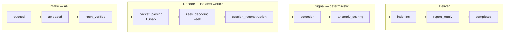
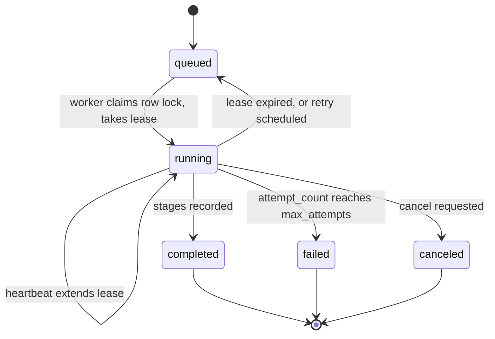
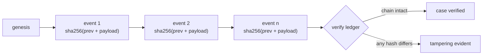
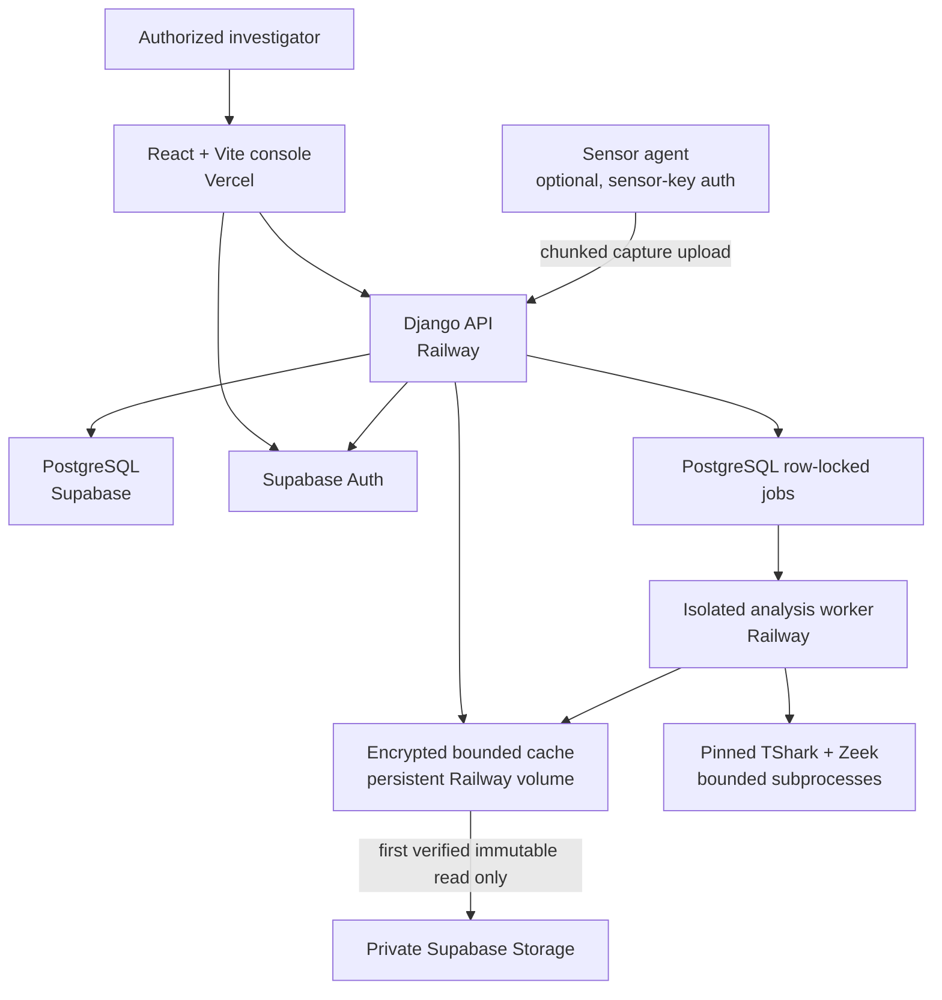

<a href="https://netra-hackathon-console-20260714.vercel.app"></a>
<a href="https://netra-hackathon-console-20260714.vercel.app"></a>

<br clear="all">

## See the traffic. Build the case.

**Netra** is a case-oriented network forensics platform. It turns authorized packet captures into structured evidence, explainable signals, custody history, and investigator-ready reports — with every API route, every byte at rest, and every custody entry accounted for.


### [**▶ Open the controlled demo**](https://netra-hackathon-console-20260714.vercel.app) · [How analysis works](#how-analysis-actually-works) · [Authorization](#authorization-layers) · [Custody](#evidence-integrity-and-custody) · [Hosting](#how-netra-is-hosted) · [Quick start](#local-quick-start) · [Docs](#documentation)

> [!IMPORTANT]
> Netra is a controlled demonstration and active security-remediation project. Use it only on networks and packet captures you are authorized to investigate. Automated detections support investigator review; they are not certified legal conclusions. Production writes remain closed until the platform activation gates pass.


## Contents

| | |
|---|---|
| [Why Netra exists](#why-netra-exists) · [The evidence pipeline](#the-evidence-pipeline) · [How analysis actually works](#how-analysis-actually-works) | [Authorization layers](#authorization-layers) · [Evidence integrity and custody](#evidence-integrity-and-custody) |
| [Architecture](#architecture) · [How Netra is hosted](#how-netra-is-hosted) · [Inside the console](#inside-the-console) | [Free-plan safeguards](#free-plan-safeguards) · [Local quick start](#local-quick-start) · [Development and tests](#development-and-tests) |
| [Repository map](#repository-map) · [Explore Netra and its references](#explore-netra-and-its-references) | [Documentation](#documentation) · [What to take care of](#what-to-take-care-of) · [Status and limitations](#project-status-and-limitations) |

## Why Netra exists

A packet capture is not evidence. It becomes evidence when someone can say *where it came from, that nobody altered it, what it shows, and who looked at it* — and can still say that months later, under challenge.

Most network tooling optimises for the first question only. Netra is built around the other three. A capture enters against a specific case, is hashed and encrypted before anything reads it, is decoded inside a worker that cannot reach the rest of the system, produces signals that state their own limitations, and leaves a hash-chained custody trail behind every step.

The trade is deliberate: Netra is slower and narrower than a general packet analyser, and it refuses operations that would leave an unexplainable gap in the record.

## The evidence pipeline



Every capture follows the same ordered path, and every step is scoped to a case.

| Stage | What happens |
|---|---|
| **Capture or upload** | PCAP / PCAPNG intake against a case, with resumable transfer and per-user and per-organization upload ceilings |
| **Preserve** | Hash, encrypt, and open a custody record *before* any parser reads the file |
| **Decode** | Packets and protocols are parsed inside the isolated worker under hard resource limits |
| **Detect** | Deterministic rule and anomaly signals, each carrying its own provenance and stated limitations |
| **Investigate** | Sessions, communication graph, payloads, and timeline, all scoped to the case and job you selected |
| **Report** | Investigator-reviewed findings, exports, and immutable artifact generations |

## How analysis actually works

A processing job is a row in PostgreSQL, not a message on a bus. The API admits it; a separate worker service claims it under a row lock and walks it through eleven recorded steps.



Each step is persisted on the job, so a half-finished analysis is legible rather than mysterious.

### The queue is boring on purpose

No broker, no at-least-once ambiguity. Jobs are claimed with `SELECT … FOR UPDATE`, held on a lease, and released deterministically.



Jobs carry an idempotency key, an attempt counter (default max 3), a lease owner, a lease expiry, and a heartbeat. A worker that dies mid-stage loses its lease and the job returns to the queue instead of vanishing or double-running.

### The worker is the blast radius

Parsers treat every capture as hostile input — see the [parser threat model](docs/PARSER_THREAT_MODEL.md). Production PCAP processing happens **only** in the worker service, never in the API process, and every parser invocation runs under explicit limits.

| Control | Default |
|---|---|
| Executable allowlist | `tshark`, `zeek`, `tcpdump`, `mergecap`, `capinfos`, `editcap` — nothing else can be spawned |
| Wall-clock timeout | 180 s |
| CPU time | 180 s |
| Address space | 512 MiB |
| stdout / stderr | Capped and truncated, so a chatty parser cannot exhaust memory |
| Open files / processes / temp bytes | Individually capped per invocation |
| Environment | Scrubbed; the parser runs in a scratch working directory |

Tool versions are pinned and verified at worker start — see [worker image supply chain](docs/WORKER_IMAGE_SUPPLY_CHAIN.md). If a capability check fails, the worker refuses work rather than silently degrading.

### Detectors state their own limits

The active registry is deterministic and readable — no model file is loaded at runtime, and executable `pickle`/`joblib` artifacts were removed from the codebase.

| Rule | Category | Severity |
|---|---|---|
| `rule-bruteforce-ssh-ftp` | Credential attack | high |
| `rule-botnet-telnet-scanning` | Reconnaissance / botnet | critical |
| `rule-port-scan-reconnaissance` | Reconnaissance | high |
| `rule-malware-c2-beacon` | Malware communication | high |
| `rule-dns-tunnel` | Covert channel | critical |
| `rule-icmp-tunnel` | Covert channel | medium |
| `rule-data-exfiltration` | Exfiltration | high |
| `rule-remote-command-execution` | Service exploitation | critical |
| `rule-service-exploit-web` | Service exploitation | high |
| `rule-smb-netbios-lateral` | Lateral movement | high |
| `rule-smtp-suspicious` | Data transfer | medium |

Every detector ships the same two limitations in its own definition, and they surface with the finding:

> Network metadata alone does not establish attribution. Correlate with endpoint and service logs.

> [!NOTE]
> The `ml-services/anomaly-engine` package exists and is explainable, but **ML production approval is deliberately withheld** — the held-out training and evaluation evidence is not yet representative enough to justify it. The deterministic registry is what runs.


## Authorization layers



Every route in the API carries a policy across five independent dimensions, derived from the route's own shape in [`route_policies.py`](backend/apps/forensics/route_policies.py) and exported to a checked-in inventory at [`docs/api/ROUTE_POLICY_INVENTORY.json`](docs/api/ROUTE_POLICY_INVENTORY.json). Generating that inventory fails loudly if any URL pattern is missing its policy.

| Gate | Values | What it decides |
|---|---|---|
| **Authentication** | `anonymous` · `bearer` · `sensor-key` | Anything not explicitly anonymous requires a verified token — the default is closed |
| **Scope** | `none` · `organization` · `case` · `case+job` | Which tenant, case, and processing job the request may even name |
| **Capability** | feature key or none | Whether that capability is enabled at all in this deployment |
| **Assurance** | `none` · `aal1` · `aal2` | Whether a second factor is required for this specific operation |
| **Rate** | `read` · `mutation` · `specialized` · `excluded` | Which atomic counter the request spends from |

The current census across all **183** routes:

| Authentication | | Scope | | Assurance | | Rate class | |
|---|---:|---|---:|---|---:|---|---:|
| bearer | 173 | organization | 92 | aal1 | 167 | read | 109 |
| sensor-key | 6 | case | 52 | none | 10 | mutation | 35 |
| anonymous | 4 | case+job | 27 | **aal2** | **6** | specialized | 29 |
| | | none | 12 | | | excluded | 10 |

Only four routes are anonymous: health, capabilities, login, and token refresh. The six AAL2 routes are the ones that change who holds power — administrator operations, user management, MFA setup, and writing integration credentials.

<details>
<summary><b>Identity, roles, and what the browser is trusted with</b></summary>

<br>

Authentication is Supabase Auth. The API verifies tokens itself using **ES256** (EC P-256) against the project's JWKS endpoint, with a cached key set, a bounded response read, and redirects refused — it does not take the client's word for identity and does not call out to a shared secret.

Four organization roles are defined: **Admin**, **Investigator**, **Analyst**, **Viewer**. A database constraint enforces *exactly one Admin per organization*, so administrator transfer is a real transaction rather than a convention. Case membership is separate from organization role, so access to a case is granted, not inherited.

The browser never receives a Supabase service-role key and never queries application tables directly. All application access is mediated by authenticated Django endpoints. Browser-facing Supabase Realtime is disabled; state arrives through authenticated refreshes and SSE.

Rate limits are atomic database counters, not in-memory guesses, so they hold across replicas:

| Bucket | Default |
|---|---|
| Reads | 300 / minute |
| Mutations | 60 / minute |
| Uploads | 10 per user per hour · 25 per organization per hour |
| Reports · exports | 10 per user per hour, each |
| SSE streams | 12 per user per minute · 60 per organization per minute |
| Webhook test | 5 per admin per hour |

</details>

## Evidence integrity and custody

Evidence is encrypted before it is durable, and the encryption is bound to *which* artifact it is — a ciphertext lifted from one case cannot be replayed as another.

| Layer | Design |
|---|---|
| Cipher | AES-256-GCM, chunked (8 MiB default, 1–16 MiB bounds) |
| Key derivation | HKDF-SHA256 with a per-artifact salt and an artifact-specific info domain |
| Key wrapping | A per-artifact data key, itself wrapped with AES-256-GCM |
| Binding | Additional authenticated data ties every chunk to its artifact context, chunk index, key id, and generation id |
| Paths | New artifacts land on immutable generation-specific paths — a regenerated artifact never overwrites its predecessor |
| Legacy | Old Fernet artifacts are **decrypt-only**; migration is an explicit, resumable, byte-capped command |

Custody is an append-only hash chain. Each event commits to the one before it:



Payloads are canonicalised before hashing, so the chain is reproducible rather than dependent on serialization order. The update and delete paths for custody events are deliberately implemented as no-ops — the ledger only grows. Ed25519 external anchoring is available to publish chain state outside the database.

> [!WARNING]
> Custody records are **tamper-evident, not tamper-proof**. A direct database administrator can rewrite rows; the chain makes that *detectable*, not impossible. Anchoring externally is what shrinks that window. Treat database admin access as part of your threat model, not outside it.

## Architecture



The API and the worker are **separate deployments from separate Dockerfiles**. They share secrets and a database, but the worker is the only thing that runs a parser, and the API is the only thing that terminates a browser request. Neither can take the other's job.

## How Netra is hosted

| Surface | Platform | What runs there | Notes |
|---|---|---|---|
| Console | **Vercel** | Vite-built React SPA | SPA rewrites, strict CSP, security headers set at the edge |
| API | **Railway** | `backend/Dockerfile`, gunicorn | Health check on `/api/health`, 300 s grace, 20 s overlap and drain |
| Worker | **Railway** | `backend/Dockerfile.worker` | Restart on failure up to 10 times; pinned amd64 image |
| Database | **Supabase** | PostgreSQL 17 | 53 public application tables, 17 forensics migrations |
| Auth | **Supabase Auth** | ES256 / JWKS | Verified in-process by the API |
| Objects | **Supabase Storage** | Private buckets | Never public; reached through the encrypted cache |
| Cache | Railway volume | `/app/storage` | Encrypted, LRU, hard-capped |

Deploys run `python manage.py check --deploy && python manage.py migrate --noinput` before traffic shifts, so a deployment that would fail a deployment check never becomes live.

The console ships a restrictive Content-Security-Policy with an explicit `connect-src` allowlist (its own origin, the Railway API, the Supabase project — nothing else), `object-src 'none'`, `frame-ancestors 'none'`, `base-uri 'none'`, and `form-action 'self'`. Only `VITE_*` values ever enter the public bundle; every backend secret lives in Railway or a Git-ignored local file.


## Inside the console

| Surface | What an investigator does there |
|---|---|
| **Cases** | Open, scope, and track a case; manage membership, status, priority, notes, and links |
| **Evidence** | Upload and verify captures, inspect manifests, follow custody history |
| **Traffic** | Packets, protocols, payloads, sessions, timeline, and the communication graph |
| **Findings** | Review detector signals with their provenance and stated limitations |
| **Reports** | Build reviewed findings into reports and exports |
| **Operations** | Processing jobs, worker health, capture jobs, sensors, and retention |
| **Integrations** | External connections and delivery, with encrypted-only credential writes |
| **Admin** | Organization users, roles, and administrator transfer — AAL2 gated |

The console ships in **English, हिन्दी, and ગુજરાતી**, and is tested for accessibility with axe under Playwright alongside the functional suite.

## Free-plan safeguards

The default posture is designed to stay inside Supabase Free, Railway Hobby, and Vercel Free limits — a demo that quietly burns a quota is a demo that dies mid-judging.

| Safeguard | Behaviour |
|---|---|
| Realtime and deep probes | Supabase Realtime and recurring deep Storage checks are disabled |
| Health checks | Routine checks inspect bucket/cache metadata and transfer no object bytes |
| Cache ceiling | Capped at 600 MiB, preserving at least 200 MiB of volume free space, evicted LRU |
| Repeat reads | A verified repeat read of an immutable object causes **zero** Supabase Storage GETs |
| Migration execution | Requires explicit project confirmation, resumable state, and a source-byte ceiling |
| Background refresh | Stops on hidden tabs and avoids loading large processing JSON for summary metrics |
| Live migration | Capped at 0.75 GB and cannot start before the source egress quota resets |

## Local quick start

**Prerequisites** — Docker Desktop with Compose · Node.js and npm · PostgreSQL 17 client tools for migration rehearsal · optionally TShark and Zeek.

**1. Create a local environment file from the sanitized template**

```powershell
Copy-Item .env.supabase.production.example .env.supabase.production.local
```

Replace every `replace-*` value locally, and never commit that file.

**2. Start the free-plan-safe web stack**

```powershell
npm run netra:start
```

**3. Stop or validate it**

```powershell
npm run netra:stop
npm run netra:validate
```

The production-like Docker profile keeps direct upload, replay, deep Storage probes, browser Realtime, and Supabase workers disabled until explicitly reviewed.

## Development and tests

<details open>
<summary><b>Backend</b></summary>

```powershell
Set-Location backend
python manage.py test apps.forensics.tests
python manage.py makemigrations --check --dry-run
python manage.py check
```

</details>

<details open>
<summary><b>Frontend</b></summary>

```powershell
Set-Location frontend
npm install
npm test -- --run
npm run lint
npm run build
```

</details>

> [!NOTE]
> PostgreSQL-specific locking tests must run against PostgreSQL 17. SQLite is fine for fast functional tests but cannot prove `SELECT FOR UPDATE` concurrency behavior — which is exactly the property the job queue depends on.

Continuous integration runs three workflows on `main` — [`quality`](.github/workflows/ci.yml), [`security`](.github/workflows/security.yml), and [`containers`](.github/workflows/container.yml):

| Check | Tool |
|---|---|
| Static analysis | Bandit, Semgrep (`--error`), CodeQL |
| Dependency audit | `pip-audit` across API, worker and sensor locks · `npm audit` at `--audit-level=high` |
| Lock integrity | Every install is `--require-hashes --only-binary=:all:`; locks are recompiled in CI and must match |
| Container scan | Trivy, failing the build on HIGH/CRITICAL with a fix available |
| Image identity | Container runtime identity is verified before publishing |

Actions are pinned by commit SHA, not by tag.

## Repository map

```text
backend/              Django API, authorization, workers, crypto and custody
  apps/forensics/     Models, routes, route policies, services, management commands
  common/             Analysis, parsers, vault, custody, tenancy, rate limits
frontend/             React/Vite investigation console (EN / HI / GU)
infra/docker/         Production-like Compose configuration
infra/scripts/        Start, stop, validation and migration helpers
ml-services/          Explainable anomaly-analysis package (not production-approved)
sensor-agent/         Native capture companion and scripts
docs/                 Security, migration and operational documentation
storage/              Runtime volume layout; generated content is Git-ignored
```

## Explore Netra and its references

Every QR code below resolves directly to the visible destination. Scanning is optional; each resource is also a standard link.

| Resource | QR | Direct link |
|---|---:|---|
| Controlled live demo |  | [Open the controlled demo](https://netra-hackathon-console-20260714.vercel.app) |
| Source code |  | [View the GitHub repository](https://github.com/krishna0605/Netra) |
| CIC-IDS2017 |  | [View the CIC-IDS2017 dataset](https://www.unb.ca/cic/datasets/ids-2017.html) |
| UNSW-NB15 |  | [View the UNSW-NB15 dataset](https://research.unsw.edu.au/projects/unsw-nb15-dataset) |
| ICISSP research paper |  | [Open the paper through its DOI](https://doi.org/10.5220/0006639801080116) |

The public datasets and paper are references, not bundled training data. Their respective owners and licenses govern their use.

## Documentation

| Document | Covers |
|---|---|
| [Platform activation runbook](docs/PLATFORM_ACTIVATION_RUNBOOK.md) | Owner-executed activation; repository preparation authorizes nothing on its own |
| [Supabase migration runbook](docs/NETRA_SUPABASE_MIGRATION_RUNBOOK.md) | Migrating durable Netra data between Supabase projects |
| [Cutover and rollback checklist](docs/CUTOVER_AND_ROLLBACK_CHECKLIST.md) | Documentation-only checklist; it does not authorize a deployment |
| [Key rotation and recovery](docs/KEY_ROTATION_AND_RECOVERY.md) | Evidence-encryption and custody-anchor signing keys, by variable name only |
| [Production environment contract](docs/PRODUCTION_ENVIRONMENT_CONTRACT.md) | Variable ownership and validation; never deployed values |
| [Parser threat model](docs/PARSER_THREAT_MODEL.md) | Treating captures and parser output as untrusted after authentication |
| [Worker operations runbook](docs/WORKER_OPERATIONS_RUNBOOK.md) | Running the API and worker as separate Railway services |
| [Worker image supply chain](docs/WORKER_IMAGE_SUPPLY_CHAIN.md) | The pinned amd64 worker image and what a rearchitecture would require |
| [MFA and account recovery](docs/MFA_RECOVERY_RUNBOOK.md) | The reviewed recovery boundary for administrator and user accounts |
| [Analysis scoping contract](docs/api/analysis-scoping.md) | How every granular analysis request names workspace and processing job |
| [Tenancy and administrator API](docs/api/TENANCY_AND_ADMIN_API.md) | Organization, membership, and administrator-transfer endpoints |
| [Route policy inventory](docs/api/ROUTE_POLICY_INVENTORY.json) | The generated per-route policy for all 183 routes |

## What to take care of

If you are evaluating, extending, or deploying this, these are the things that will actually bite.

| | |
|---|---|
| **Authorization is yours, not ours** | Nothing here grants you the right to capture traffic. Confirm legal authority, organizational policy, and retention obligations *before* the first packet. |
| **Key material is unrecovered if lost** | Evidence keys and custody-anchor signing keys have no backdoor. Read [key rotation and recovery](docs/KEY_ROTATION_AND_RECOVERY.md) and establish custody of the keys before you store anything you care about. |
| **The database admin is inside the trust boundary** | Custody is tamper-evident, not tamper-proof. If you need stronger assurance, enable external Ed25519 anchoring and store anchors somewhere the database admin does not control. |
| **The storage volume is state** | The Railway `/app/storage` volume holds the encrypted cache. It still requires external verification, and losing it loses cached artifacts — not evidence, but rebuild cost and egress. |
| **Egress is a real budget** | The free-plan safeguards exist because Storage egress is the first thing to blow up. Do not disable the cache or re-enable deep probes without recalculating quota. |
| **Email flows are off by design** | Invitations and password recovery are disabled because Netra does not own a verified SMTP domain. Existing-user login and Administrator TOTP work. No temporary-password fallback is offered, and none should be added casually. |
| **Detections are leads, not conclusions** | Every finding carries its limitations for a reason. Correlate with endpoint and service logs before anything leaves the building. |
| **Do not skip the gates** | Platform activation, migration, backup, and rollback each have a runbook and each expects sanitized evidence. They are not ceremony. |

## Project status and limitations

- Repository security, tenancy, cryptography, worker isolation, authentication, accessibility, dependency, container, and CI controls are implemented and verified locally. GitHub and hosted-platform activation have not occurred.
- Email invitation and password-recovery implementations are intentionally disabled in the hackathon deployment because Netra does not yet own a verified SMTP domain. Existing-user password login and Administrator TOTP remain enabled; no temporary-password or insecure fallback flow is offered.
- The current deterministic detector registry is active; ML production approval is intentionally withheld because representative held-out training/evaluation evidence is insufficient.
- Do not deploy until the platform activation, migration, backup, and rollback gates have been completed with sanitized evidence.
- The persistent Railway `/app/storage` volume and production key material still require external verification.
- No production crypto migration has been executed, and no legacy object has been deleted.


## Responsible use

Netra is for defensive security, authorized investigations, education, and controlled demonstrations. Do not capture, inspect, retain, or disclose network traffic without authorization. Review applicable law, organizational policy, evidence-retention requirements, and chain-of-custody procedures before operational use.
