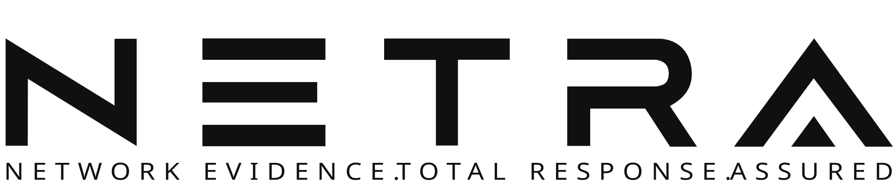
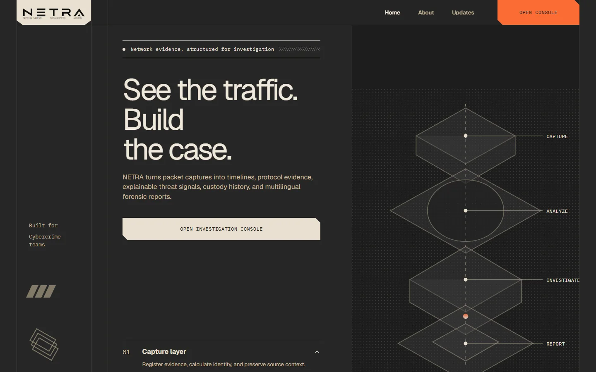
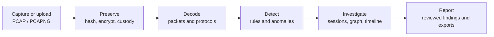
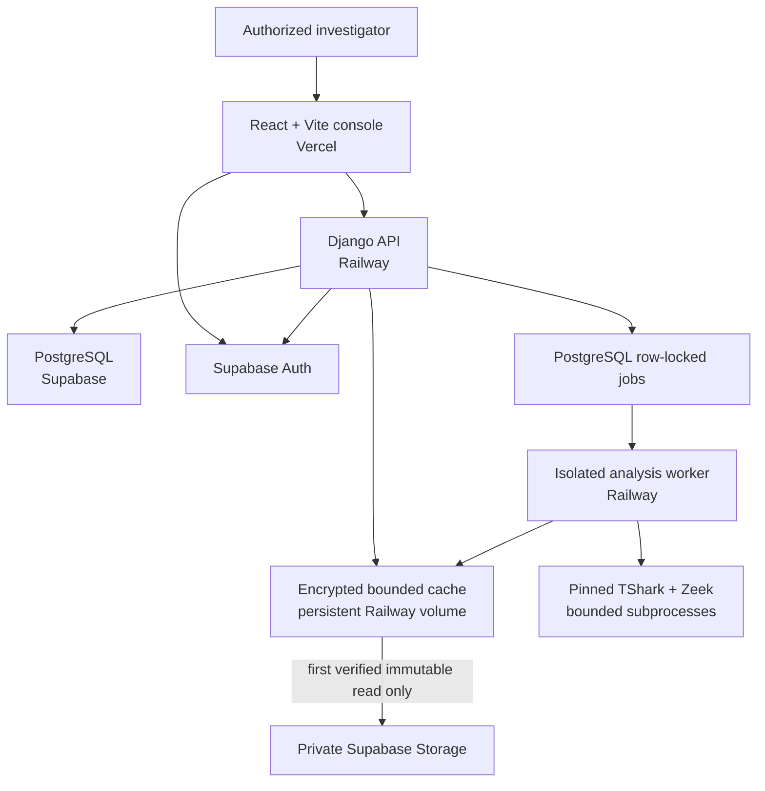

<p align="center">
  
</p>

<h1 align="center">See the traffic. Build the case.</h1>

<p align="center">
  Netra is a case-oriented network forensics platform that turns authorized packet captures into structured evidence, explainable signals, custody history, and investigator-ready reports.
</p>

> [!IMPORTANT]
> Netra is a controlled demonstration and active security-remediation project. Use it only on networks and packet captures you are authorized to investigate. Automated detections support investigator review; they are not certified legal conclusions. The current remediation branch is not yet approved for production deployment.



<p align="center"><em>Synthetic demonstration data. No real identity, evidence, case, address, or credential is shown.</em></p>

## What Netra does



- Case-scoped evidence intake and processing jobs
- Packet, protocol, payload, session, timeline, and communication-graph views
- Worker-isolated TShark and Zeek analysis with deterministic, investigator-reviewable detector signals
- Encrypted evidence, immutable artifact generations, custody history, reports, and exports
- Organization boundaries, role-based access, AAL2 administrator operations, and audit privacy
- Free-plan-aware Storage caching, bounded polling, and metadata-only routine health checks

## Explore Netra and its references

Every QR code below resolves directly to the visible destination. Scanning is optional; each resource is also a standard link.

| Resource | QR | Direct link |
|---|---:|---|
| Controlled live demo |  | [Open the controlled demo](https://netra-hackathon-console-20260714.vercel.app) |
| Source code |  | [View the GitHub repository](https://github.com/krishna0605/Netra) |
| CIC-IDS2017 |  | [View the CIC-IDS2017 dataset](https://www.unb.ca/cic/datasets/ids-2017.html) |
| UNSW-NB15 |  | [View the UNSW-NB15 dataset](https://research.unsw.edu.au/projects/unsw-nb15-dataset) |
| ICISSP research paper |  | [Open the paper through its DOI](https://doi.org/10.5220/0006639801080116) |

The public datasets and paper are references, not bundled training data. Their respective owners and licenses govern their use.

## Architecture



The browser does not receive a Supabase service-role key and does not query application tables directly. Netra application access is mediated by authenticated Django endpoints. Browser-facing Supabase Realtime is disabled; authenticated API refreshes and SSE provide application state.

## Security model

Netra’s remediation work is organized as independently verified phases. The current local branch includes:

- workspace/job-scoped analysis reads and exact transactional finding mutations;
- strict case identifiers, contained artifact paths, and autoescaped reports;
- organization tenancy, audit privacy, atomic rate and queue limits, and administrator invariants;
- AES-256-GCM chunked artifact encryption with artifact-specific HKDF domains;
- a deterministic case-locked custody ledger with optional Ed25519 external anchors;
- a persistent encrypted object cache with LRU eviction and hard capacity gates.
- worker-only production PCAP processing with bounded parser execution and exact tool capabilities;
- a canonical detector registry with executable pickle/joblib models removed.

New durable artifacts use immutable generation-specific paths. Legacy Fernet artifacts are decrypt-only and can be migrated only through an explicit, resumable, byte-capped command. Custody records are **tamper-evident**, not tamper-proof; direct database administrator access crosses that trust boundary.

See [security finding traceability](docs/SECURITY_FINDING_TRACEABILITY.md), the [remediation runbook](docs/SECURITY_REMEDIATION_RUNBOOK.md), and [production migration blockers](docs/PRODUCTION_MIGRATION_MISSING.md) before treating any environment as production-ready.

## Free-plan safeguards

The default deployment posture is designed for Supabase Free, Railway Hobby, and Vercel Free limits:

- Supabase Realtime and recurring deep Storage checks are disabled.
- Routine health checks inspect bucket/cache metadata and transfer no object bytes.
- The encrypted cache is capped at 600 MiB and preserves at least 200 MiB of volume free space.
- A verified repeat read of an immutable object causes zero Supabase Storage GETs.
- Migration execution requires an explicit project confirmation, resumable state, and source-byte ceiling.
- Background refreshes stop on hidden tabs and avoid loading large processing JSON for summary metrics.
- The future live migration remains capped at 0.75 GB and cannot start before the source egress quota resets.

## Local quick start

### Prerequisites

- Docker Desktop with Docker Compose
- Node.js and npm
- PostgreSQL 17 client tools for migration rehearsal
- Optional analysis tools: TShark and Zeek

Create a local environment file from the sanitized template:

```powershell
Copy-Item .env.supabase.production.example .env.supabase.production.local
```

Replace every `replace-*` value locally. Never commit that file. Backend secrets belong in Railway or a Git-ignored local file; only `VITE_*` values may enter the public frontend bundle.

Start the free-plan-safe web stack:

```powershell
npm run netra:start
```

Stop or validate it with:

```powershell
npm run netra:stop
npm run netra:validate
```

The production-like Docker profile keeps direct upload, replay, deep Storage probes, browser Realtime, and Supabase workers disabled until explicitly reviewed.

## Development and tests

Backend:

```powershell
Set-Location backend
python manage.py test apps.forensics.tests
python manage.py makemigrations --check --dry-run
python manage.py check
```

Frontend:

```powershell
Set-Location frontend
npm install
npm test -- --run
npm run lint
npm run build
```

PostgreSQL-specific locking tests must run against PostgreSQL 17. SQLite is useful for fast functional tests but cannot prove `SELECT FOR UPDATE` concurrency behavior.

## Repository map

```text
backend/              Django API, authorization, workers, crypto and custody
frontend/             React/Vite investigation console
infra/docker/         Production-like Compose configuration
infra/scripts/        Start, stop, validation and migration helpers
ml-services/          Explainable anomaly-analysis package
sensor-agent/         Native capture companion and scripts
docs/                 Security, migration and operational documentation
storage/              Runtime volume layout; generated content is Git-ignored
```

## Current limitations

- Phase 4 is locally complete; Phases 5-7 remain incomplete.
- Integration truthfulness, MFA enrollment/recovery UX, CI scanning, and branch protection are later-phase gates.
- The current deterministic detector registry is active; ML production approval is intentionally withheld because representative held-out training/evaluation evidence is insufficient.
- This branch must not be merged directly into `main`; Railway and Vercel are connected to the repository and could automatically deploy an incomplete intermediate phase.
- The persistent Railway `/app/storage` volume and production key material still require external verification.
- No production crypto migration has been executed, and no legacy object has been deleted.

## Documentation

- [Supabase migration runbook](docs/NETRA_SUPABASE_MIGRATION_RUNBOOK.md)
- [Security remediation runbook](docs/SECURITY_REMEDIATION_RUNBOOK.md)
- [Security finding traceability](docs/SECURITY_FINDING_TRACEABILITY.md)
- [Key rotation and recovery](docs/KEY_ROTATION_AND_RECOVERY.md)
- [Production migration missing inputs](docs/PRODUCTION_MIGRATION_MISSING.md)
- [Parser threat model](docs/PARSER_THREAT_MODEL.md)
- [Worker operations runbook](docs/WORKER_OPERATIONS_RUNBOOK.md)
- [Phase 4 verification](docs/PHASE_4_VERIFICATION.md)
- [README asset provenance](docs/assets/readme/ASSET_PROVENANCE.md)

## Responsible use

Netra is for defensive security, authorized investigations, education, and controlled demonstrations. Do not capture, inspect, retain, or disclose network traffic without authorization. Review applicable law, organizational policy, evidence-retention requirements, and chain-of-custody procedures before operational use.
