# Netra key rotation and recovery

This runbook covers evidence-encryption keys and custody-anchor signing keys. It intentionally contains variable names and procedures only. Never paste key values into documentation, chat, Git, CI logs, or frontend configuration.

## Roles and boundaries

| Material | Scope | Storage | Browser exposure |
|---|---|---|---|
| `NETRA_EVIDENCE_KEY` | Active v2.1 artifact encryption | Railway secret manager | Prohibited |
| `NETRA_EVIDENCE_KEY_ID` | Stable non-secret active key label | Railway backend variable | Unnecessary |
| `NETRA_EVIDENCE_PREVIOUS_KEYS` | Decrypt-only rollback keys | Railway secret manager | Prohibited |
| `NETRA_CUSTODY_SIGNING_PRIVATE_KEY` | Raw Ed25519 private key, base64 encoded | Railway secret manager | Prohibited |
| `NETRA_CUSTODY_SIGNING_KEY_ID` | Stable non-secret signing key label | Railway backend variable | Unnecessary |

No key may use a `VITE_` prefix. Every `VITE_` variable is public in the compiled frontend.

## Rotation sequence

```mermaid
flowchart LR
    GENERATE["Generate key material<br/>outside Git"]
    READERS["Deploy readers with<br/>active + previous keys"]
    WRITER["Activate new key ID<br/>for v2.1 writes"]
    SYNTHETIC["Round-trip one local<br/>synthetic artifact"]
    PLAN["Run plan-only<br/>migration inventory"]
    WINDOW["Approve quota and<br/>maintenance window"]
    EXECUTE["Execute resumable<br/>byte-capped migration"]
    ANCHOR["Export and verify<br/>signed custody anchors"]
    RETAIN["Retain old keys and<br/>objects for seven days"]
    REMOVE["Remove only after<br/>explicit approval"]

    GENERATE --> READERS --> WRITER --> SYNTHETIC --> PLAN --> WINDOW --> EXECUTE --> ANCHOR --> RETAIN --> REMOVE
```



1. Generate high-entropy evidence key material and a 32-byte Ed25519 private key on an approved offline operator workstation.
2. Add the new evidence key and key ID through Railway secrets. Keep the previous evidence key in the decrypt-only list.
3. Deploy readers before changing the active writer key.
4. Verify a small synthetic v2.1 artifact locally and confirm its manifest HMAC, chunk authentication, plaintext digest, ciphertext digest, and custody event.
5. Run `migrate_evidence_crypto --plan`. Plan mode must report that no Storage object was read or written.
6. Do not use `--execute` until the source quota has reset, the migration budget is approved, and the target project reference is independently confirmed.
7. Execute with concurrency one, resumable state outside Git, a positive byte ceiling, a future retention timestamp, and at most two attempts per artifact.
8. Export custody anchors and verify them independently before declaring the rotation complete.
9. Retain legacy objects and decrypt-only keys for at least the agreed seven-day rollback period.
10. Perform a restore drill from a retained artifact and validate its forensic plaintext hash.
11. Remove old keys and legacy objects only after explicit owner approval and an archived verification record.

## Safe command shapes

Plan only - performs no object transfer:

```powershell
python manage.py migrate_evidence_crypto `
  --plan `
  --state C:\approved-encrypted-workspace\crypto-state.json
```

Execution shape for the later approved window:

```powershell
python manage.py migrate_evidence_crypto `
  --execute `
  --resume `
  --state C:\approved-encrypted-workspace\crypto-state.json `
  --max-source-bytes 629145600 `
  --retain-until 2026-08-15T12:00:00+05:30 `
  --confirm-project-ref TARGET_PROJECT_REFERENCE
```

The command refuses state inside the repository, unknown-size Supabase pointers, missing project confirmation, an unlimited/invalid byte budget, or a past/naive retention time. It never deletes a legacy object.

Export and verify privacy-minimal anchors:

```powershell
python manage.py export_custody_anchors --case-id CASE_REFERENCE --output-directory C:\approved-anchor-output
python manage.py verify_custody_anchor C:\approved-anchor-output\ANCHOR_FILE.json
```

Use `--upload` only in a separately approved operational window. The default export is local.

## Recovery scenarios

### Active evidence key is unavailable

1. Stop artifact writers and workers; keep reads closed if key identity is uncertain.
2. Restore the exact key from the approved secret backup into Railway without logging it.
3. Confirm its key ID matches affected manifests.
4. Verify one retained synthetic artifact and one approved production artifact through the persistent encrypted cache.
5. Resume one worker group at a time.

### Previous key was removed too early

1. Stop migration and key cleanup.
2. Restore the previous decrypt-only key from the approved secret backup.
3. Re-run plan mode and reconcile committed state against database pointers.
4. Do not generate replacement ciphertext until the source plaintext identity hash verifies.

### Custody signing key is unavailable

Evidence remains decryptable, but new external anchors must stop. Restore the signing key or introduce a reviewed new signing key ID. Never forge an old key identity. Preserve previously exported anchors and public keys for independent verification.

### Cache or Railway volume is lost

The database and private Storage remain authoritative; the cache is replaceable. Keep deep checks disabled, verify the volume mount and sentinel, then allow one immutable object at a time to repopulate. Monitor Supabase Usage after each approved batch. Do not bypass cache capacity failures.

## Completion evidence

- active and previous key IDs (never key values);
- migration run ID, byte ceiling, bytes read, conflicts, attempts, and retained-until date;
- database pointer and manifest digest reconciliation;
- signed custody anchor locations and independent verification result;
- restore-drill artifact ID and matching plaintext digest;
- Supabase Usage before/after delta;
- explicit approval for legacy-key or object retirement.
