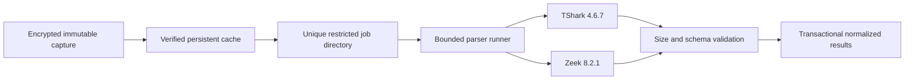

# Netra parser threat model

## Scope

This model covers authorized PCAP/PCAPNG processing by the dedicated Netra worker. Packet captures and parser output are untrusted even after authentication. The Django API is outside the parser execution boundary and contains no TShark, Zeek, or tcpdump binary.

## Assets and boundaries

Protected assets include evidence confidentiality and integrity, worker availability, organization/case boundaries, database credentials, Storage credentials, encryption keys, custody records, and host resources. Trust is crossed when encrypted Storage content enters the worker cache, plaintext enters a temporary job directory, an external parser emits bytes, and validated results enter application models.

## Threats and controls

| Threat | Control | Failure behavior |
|---|---|---|
| Argument or shell injection | Server-built argument arrays, `shell=False`, absolute discovered executable | Reject before execution |
| Path traversal/symlink escape | Resolved input and working directory containment; server-controlled outputs | Reject and remove temporary state |
| Parser hangs or forked children | Wall timeout, new process session, process-group termination | `analysis_tool_timeout` |
| Output/memory/disk exhaustion | Bounded stdout/stderr, CPU/address-space/file/process/open-file/temp limits | `analysis_output_limit` or `analysis_worker_resource_limit` |
| Secret inheritance | Minimal allowlisted environment; no proxy/cloud secret variables | Fail closed if required environment cannot be constructed |
| Malformed or hostile output | Size, encoding, structure, and field validation before application parsing | `analysis_parse_failed` |
| Tool substitution/version drift | Absolute paths plus exact heartbeat/readiness versions | Worker unready; API admission returns 503 |
| Duplicate processing | PostgreSQL `SELECT FOR UPDATE SKIP LOCKED` claim | One committed claimant per job |
| Sensitive error disclosure | Stable public codes; raw stderr and local paths stay out of client responses | Sanitized job failure |
| API compromise through parser dependencies | Separate API image and lazy worker-only imports | API starts without parser packages/binaries |

Scapy is restricted to labelled diagnostic/synthetic-fixture support. It cannot silently replace TShark or Zeek for evidentiary packet, protocol, session, payload, graph, report, or custody results.

## Residual risk

TShark and Zeek process attacker-controlled formats and can contain unknown vulnerabilities. Isolation is therefore defense in depth, not proof of parser safety. The later deployment gate must add image vulnerability scanning, monitor worker resource termination, keep parser versions reviewed, and rebuild pinned images for security releases. Railway service isolation does not equal a dedicated virtual machine or kernel sandbox.

## Verification

- `test_analysis_tooling.py` covers injection, timeout, output bounds, sanitization, and cleanup.
- `test_processing_topology.py` proves worker-only admission and claiming.
- `test_worker_capabilities.py` covers exact versions, staleness, and release compatibility.
- `WORKER_IMAGE_SUPPLY_CHAIN.md` records image composition and local evidence.
