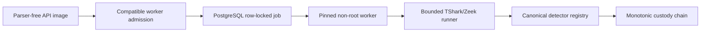

# Netra Phase 4 verification

Verification date: 9 August 2026 (Asia/Kolkata)

Branch: `codex/netra-security-remediation`

Baseline: `9e8b888`

## Outcome

Phase 4 is verified locally and remains **not approved for push, merge, or production deployment**. It adds one local Django migration (`0015_custody_chain_index`), keeps the public application table count at 51, and makes the forensics migration count 15.

## Evidence

| Gate | Result |
|---|---|
| Focused Phase 4 backend | 41 tests completed successfully: 40 run and one PostgreSQL-only test skipped under SQLite |
| Complete backend | 140 tests completed successfully: 136 run and four expected environment-specific skips |
| Disposable PostgreSQL | PostgreSQL 17.6; 11 concurrency/migration tests passed, including rate, quota, competing Admin transfer, and 50 custody appenders |
| Django model/system | No model changes detected; system check reported no issues |
| Frontend | 12 tests passed; build passed; lint had zero errors and one unchanged hook warning |
| API container | UID/GID 10001; Django check passed; TShark, Zeek, and tcpdump absent |
| Worker container | UID/GID 10001; TShark 4.6.7; Zeek 8.2.1; compiler and CMake absent |
| Worker in-container tests | 12 synthetic analysis, detector, and capability tests passed |
| Supply chain | Wireshark source SHA-256 verified; base image pinned by digest; local SPDX 2.3 SBOM generated; reviewed secret names absent from image history |
| Cloud usage | Supabase database/Storage/Auth/Realtime 0 bytes; Railway/Vercel/GitHub usage 0 |

The complete backend run emits known local-only warnings for a dependency-version mismatch in the workstation Python environment, intentionally short synthetic JWT keys, absent Kafka, and synthetic Scapy MAC discovery. These do not fail tests, but Phase 7 dependency/CI work must eliminate or formally baseline them. Frontend output also retains one known hook-dependency warning and a large-bundle warning for its later frontend/performance phase.

## Static review

- `analyze_pcap` remains only in worker pipeline/worker-only operations and explicit local management commands; it is absent from API views and startup imports.
- The only production `subprocess.Popen` call is inside `common/parser_runner.py`; it uses no shell.
- No executable pickle/joblib loader or model artifact remains. The only `.pkl` reference is a regression assertion that the file is absent.
- No stale `Fernet-AES128-CBC-HMAC` fallback remains.
- All custody append, verification, list, export, report, workspace, readiness, and anchor queries use `chain_index`.

## Egress proof

Tests set local SQLite or the disposable localhost PostgreSQL profile. Network-facing Storage providers are mocked or blocked. The crypto command ran in plan-only mode with zero legacy pointers and explicitly reported no Storage read/write. Docker downloads consumed workstation internet only; no project credential was loaded and no Supabase endpoint was called.

## Remaining external gates

1. Complete Phases 5–7.
2. Add CI/security scans and protect `main`.
3. Verify separate Railway API/worker Hobby sizing and cost.
4. Attach and restart-test the persistent `/app/storage` volume.
5. Rehearse migrations `0014` and `0015` against an encrypted disposable production-like copy.
6. Enroll the permanent administrator in TOTP/AAL2.
7. Provision backend keys only through Railway secrets.
8. Perform preview and controlled cutover only after explicit approval.

No Phase 4 commit has been pushed. Automatic Railway/Vercel deployments therefore remain untouched.
