# Phase 8B platform activation contract

This is an owner-executed runbook. Repository preparation does not authorize a push, hosted migration, deployment, Auth change, or Storage read. Keep a local byte ledger and stop all Phase 8 Supabase work at 60 MB.

```mermaid
flowchart LR
    LOCAL["Phase 8A offline gates"]
    ISOLATE["Confirm branch deployment isolation"]
    PUSH["Push remediation branch only"]
    CI["Three policy gates"]
    BACKUP["Encrypted logical backup"]
    SCHEMA["Migrations 0014-0017"]
    HARDEN["53-table RLS and grants"]
    PLATFORM["Bounded Railway, Auth, and Vercel drills"]
    DRAFT["Draft PR remains unmerged"]

    LOCAL --> ISOLATE --> PUSH --> CI --> BACKUP --> SCHEMA --> HARDEN --> PLATFORM --> DRAFT
```



## Pre-push stop gate

1. Confirm Railway production tracks only `main` and a remediation-branch push cannot replace it.
2. Configure branch-specific Vercel Preview variables before pushing. Preview receives only `VITE_API_BASE_URL`, `VITE_DEPLOYMENT_PROFILE`, `VITE_SUPABASE_URL`, `VITE_SUPABASE_PUBLISHABLE_KEY`, `VITE_DIRECT_UPLOAD_ENABLED=0`, and `VITE_MAX_UPLOAD_MB=25`.
3. Enable Vercel Authentication for preview deployments where available on Hobby.
4. Confirm no backend/database/evidence/custody secret exists in Vercel or GitHub workflow variables.
5. Record organization-wide Supabase usage and initialize the local byte ledger.
6. Push only `codex/netra-security-remediation` after explicit approval. Never push `main`.

## GitHub activation

- Require `ci-policy-gate`, `security-policy-gate`, and `container-policy-gate`.
- Fix remote-only failures in new commits; never amend prior remediation history.
- Apply `infra/github/main-ruleset.json` only after all contexts have reported.
- Enable CodeQL, Dependabot alerts/security updates, secret scanning, and push protection.
- Verify protection with `infra/github/verify-repository-protection.ps1`.
- Open a draft PR and keep it unmerged through Phases 9 and 10.

## Hosted maintenance and backup gate

- Confirm the target is empty: zero cases, evidence rows, Storage objects, and target-only ownership records. Any durable target data moves this work to Phase 9.
- Enter maintenance/read-only mode and stop all old writers/workers.
- Export an encrypted logical schema/data backup outside Git.
- Record Django/Supabase migration history, table row counts, and primary-key digests without recording credentials or user metadata.
- Never commit a dump, migration manifest containing sensitive identifiers, or Auth export.

## Migration order

The CLI syntax below was verified against Supabase CLI 2.113.0. Re-run each `--help` command at activation time because flags can change.

```text
npx supabase@latest migration list --help
npx supabase@latest db push --help
npx supabase@latest db lint --help
```

1. Rehearse Django `0014`–`0017` on disposable PostgreSQL 17.
2. Inspect hosted migration history and confirm `20260804182156_enforce_netra_target_security.sql` is already recorded.
3. Run `db push --dry-run`; stop if the historical 49-table migration would replay.
4. Apply Django migrations to the empty target.
5. Apply `20260809164520_supersede_49_table_target_hardening.sql`.
6. Apply `20260809164522_remove_netra_realtime_members.sql`.
7. Verify 53 tables, 17 Django migrations, 53/53 RLS, zero browser-facing application policies/privileges, zero Netra Realtime members, and zero materialized views.

The SQL intentionally leaves managed `auth`, `storage`, Realtime internals, extensions, and their ownership untouched. It revokes access only on Netra/Django application objects selected by their reviewed prefixes.

## Supervised one-time bootstrap

Run `python manage.py bootstrap_supabase` once without `--deep-storage-check`. It is not a Railway pre-deploy command. Expected results are 14 empty PGMQ queues, six durable private buckets plus the separately migrated quarantine bucket, and zero Netra Realtime publication members. Stop if any queue is non-empty or any bucket is public.

Routine Railway pre-deploy is limited to:

```text
python manage.py check --deploy
python manage.py migrate --noinput
```

## Bounded platform drills

- API: starts and remains ready with the worker stopped and no parser/ML dependency.
- Worker: one instance, same immutable release ID, `/app/storage` persistent volume, TShark 4.6.7, Zeek 8.2.1, and reviewed CPU/memory limits read from the actual Railway project.
- Cache: a tiny encrypted synthetic object only; first read may fetch once and the second read must cause zero Storage GETs. Remove it afterwards.
- Evidence/custody: synthetic v2.1 round trip, independently verified Ed25519 anchor, key-rotation rehearsal, and cleanup.
- Auth: remain in remote mode through the maximum token lifetime plus 15 minutes after ES256 rotation; then enable `asymmetric-jwks`. Prove AAL1 denial, AAL2 Admin success, invitation, recovery, lost-factor procedure, and global sign-out.
- Vercel: exact preview CSP, no wildcard host/image/WebSocket source, Auth/API/SSE success, and built assets containing only the publishable key.

## Egress ledger

| Workstream | Ceiling |
|---|---:|
| Backup/schema and DDL verification | 5 MB |
| Migration/readiness metadata | 5 MB |
| Tiny cache/Storage proof | 5 MB |
| Auth/JWKS/TOTP/recovery | 5 MB |
| Retry/measurement reserve | 40 MB |
| Hard stop | 60 MB |

Measure both the local byte ledger and the Supabase organization dashboard after each workstream. Dashboard lag never permits exceeding the local ceiling. Do not list a full bucket, download legacy objects, run a deep Storage bootstrap, enable Realtime, or migrate legacy data.

## Evidence commit rule

The platform-verification commit is created only after the above actions produce real sanitized evidence. It records counts, statuses, release IDs, policy results, and measured bytes—never secret values, project credentials, Auth metadata, evidence, or operator backup paths.
