# Platform activation runbook

This is an owner-executed runbook. Repository preparation does not authorize a push, hosted migration, deployment, Auth change, or Storage read. Keep a local byte ledger and stop all activation-related Supabase work at 60 MB.

```mermaid
flowchart LR
    LOCAL["Offline repository gates"]
    FREEZE["Freeze automatic deployments"]
    CI["Three policy gates"]
    BACKUP["Encrypted logical backup"]
    SCHEMA["Migrations 0014-0017"]
    HARDEN["53-table RLS and grants"]
    TAG["Signed candidate tag"]
    PUSH["Lease-guarded initial main publication"]
    DEPLOY["Manual exact-SHA deployments"]
    PLATFORM["Bounded Railway, Auth, and Vercel drills"]
    PROTECT["Protect main after evidence push"]

    LOCAL --> FREEZE --> BACKUP --> TAG --> CI --> PUSH
    PUSH --> SCHEMA --> HARDEN --> DEPLOY --> PLATFORM --> PROTECT
    CI --> PLATFORM
```



## Pre-push stop gate

1. Confirm only local `main` exists and record the exact current `origin/main` SHA.
2. Confirm Railway API/worker and Vercel Production are linked to `main`; disable automatic deployment during initial cleaned-history publication.
3. Keep Railway API and worker offline before hosted activation. Preserve the current Vercel production deployment as rollback.
4. Configure Vercel Production with only `VITE_API_BASE_URL`, `VITE_DEPLOYMENT_PROFILE`, `VITE_SUPABASE_URL`, `VITE_SUPABASE_PUBLISHABLE_KEY`, `VITE_DIRECT_UPLOAD_ENABLED=0`, and `VITE_MAX_UPLOAD_MB=25`.
5. Confirm no backend/database/evidence/custody/SMTP secret exists in Vercel or GitHub workflow variables.
6. Record organization-wide Supabase usage and initialize the local byte ledger.
7. Confirm the preserved target contains no cases or Storage objects. The existing Administrator, access logs, and stale worker-heartbeat rows remain covered by the encrypted backup.
8. Create a signed `release-candidate-*` tag, require all three policy gates on that exact SHA, then publish the initial cleaned history with an exact `--force-with-lease` value. All later releases are normal fast-forwards.

## GitHub activation

- Run `scripts/release-main.ps1 -Action PrepareCandidate` and verify the candidate before changing `main`.
- For the first cleaned-history publication only, GitHub may report zero workflows because the old default branch does not contain them. Keep Railway and Vercel frozen, then use the explicit `BootstrapMain -BootstrapFirstPublication` action. It refuses to run if GitHub already has any registered workflow, if the signed tag does not identify `HEAD`, or if the recorded remote-main SHA changed. Treat `main` as unpublished until all three policy gates complete successfully, then activate protection.
- Require `ci-policy-gate`, `security-policy-gate`, and `container-policy-gate`.
- Keep automatic platform deployments frozen until `origin/main` equals the verified candidate SHA and protection is active.
- Fix remote-only failures in new commits on local `main`; never amend or force-push prior history.
- Apply `infra/github/main-ruleset.json` after the first verified history publication. It requires signed commits and the three policy gates, with no pull-request rule or bypass actor.
- Enable CodeQL, Dependabot alerts/security updates, secret scanning, and push protection.
- Verify protection with `infra/github/verify-repository-protection.ps1`.
- Once protection is active, future changes use signed local commits on `main`, candidate-tag checks, and a fast-forward of the exact checked SHA. No persistent development branch is created.

## Hosted maintenance and backup gate

- Confirm the target still has zero cases, evidence rows, and Storage objects. Preserve the existing Administrator/audit rows through the encrypted backup; any new case/evidence/object stops this release and moves it to migration handling.
- Enter maintenance/read-only mode and stop all old writers/workers.
- Export an encrypted logical schema/data backup outside Git.
- Record Django/Supabase migration history, table row counts, and primary-key digests without recording credentials or user metadata.
- Never commit a dump, migration manifest containing sensitive identifiers, or Auth export.

## Migration order

The CLI syntax below was verified against Supabase CLI 2.113.0. Re-run each `--help` command at activation time because flags can change.

```text
npx --yes supabase@2.113.0 migration list --help
npx --yes supabase@2.113.0 db push --help
npx --yes supabase@2.113.0 db lint --help
```

1. Rehearse Django `0014`–`0017` on disposable PostgreSQL 17.
2. Inspect hosted migration history and confirm `20260804182156_enforce_netra_target_security.sql` is already recorded.
3. Run `db push --dry-run`; stop if the historical 49-table migration would replay.
4. Verify Django migrations through `0017_phase8_security_closure` are already recorded; apply only an idempotent missing migration after a fresh encrypted backup.
5. Verify `20260809164520_supersede_49_table_target_hardening.sql` is recorded.
6. Verify `20260809164522_remove_netra_realtime_members.sql` is recorded.
7. Reconfirm 53 tables, 17 Django migrations, 53/53 RLS, zero browser-facing application policies/privileges, zero Netra Realtime members, and zero materialized views.

The SQL intentionally leaves managed `auth`, `storage`, Realtime internals, extensions, and their ownership untouched. It revokes access only on Netra/Django application objects selected by their reviewed prefixes.

## Supervised one-time bootstrap

Run `python manage.py bootstrap_supabase` once without `--deep-storage-check`. It is not a Railway pre-deploy command. Expected results are 14 empty PGMQ queues, six durable private buckets plus the separately migrated quarantine bucket, and zero Netra Realtime publication members. Stop if any queue is non-empty or any bucket is public.

Routine Railway pre-deploy is limited to:

```text
python manage.py check --deploy
python manage.py migrate --noinput
```

## Bounded platform drills

- API: starts and remains ready with the worker stopped and no parser/ML dependency.
- Worker: one instance, same immutable release ID, `/app/storage` persistent volume, TShark 4.6.7, Zeek 8.2.1, and reviewed CPU/memory limits read from the actual Railway project.
- Cache: a tiny encrypted synthetic object only; first read may fetch once and the second read must cause zero Storage GETs. Remove it afterwards.
- Evidence/custody: synthetic v2.1 round trip, independently verified Ed25519 anchor, key-rotation rehearsal, and cleanup.
- Auth: remain in remote mode through the maximum token lifetime plus 15 minutes after ES256 rotation; then enable `asymmetric-jwks`. Prove existing-user login, AAL1 denial, AAL2 Admin success, lost-factor procedure, and global sign-out. Invitation and recovery email remain truthfully disabled.
- Vercel: exact preview CSP, no wildcard host/image/WebSocket source, Auth/API/SSE success, and built assets containing only the publishable key.

## Egress ledger

| Workstream | Ceiling |
|---|---:|
| Backup/schema and DDL verification | 5 MB |
| Migration/readiness metadata | 5 MB |
| Tiny cache/Storage proof | 5 MB |
| Auth/JWKS/TOTP/recovery | 5 MB |
| Retry/measurement reserve | 40 MB |
| Hard stop | 60 MB |

Measure both the local byte ledger and the Supabase organization dashboard after each workstream. Dashboard lag never permits exceeding the local ceiling. Do not list a full bucket, download legacy objects, run a deep Storage bootstrap, enable Realtime, or migrate legacy data.

## Evidence commit rule

The platform-verification commit is created only after the above actions produce real sanitized evidence. It records counts, statuses, release IDs, policy results, and measured bytes—never secret values, project credentials, Auth metadata, evidence, or operator backup paths.
