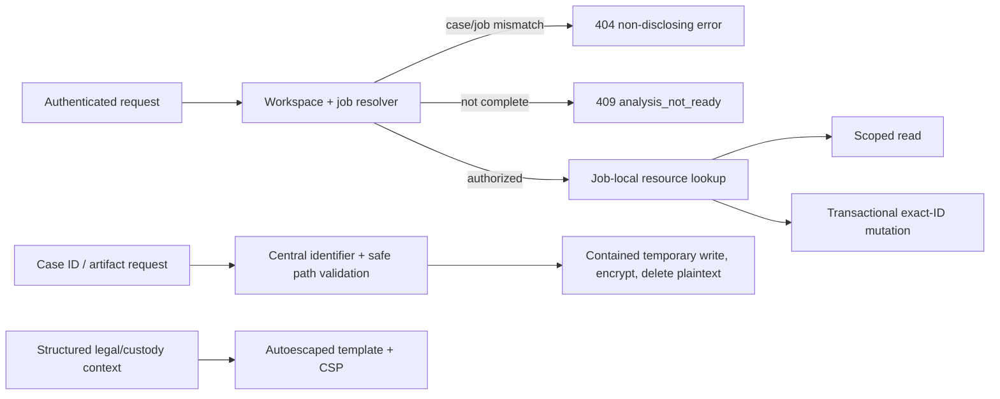
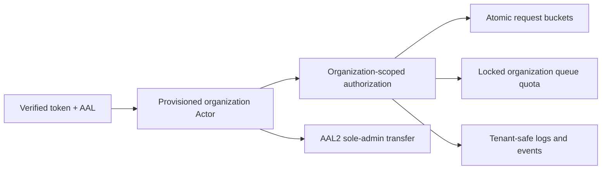
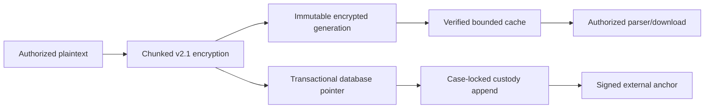
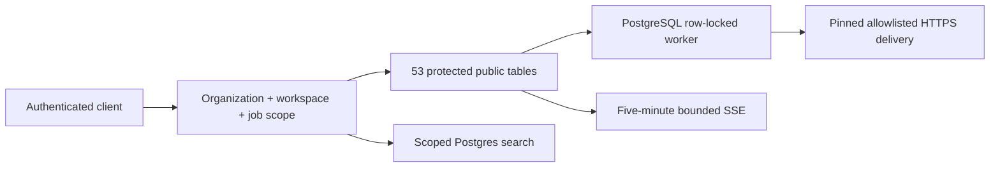

# Netra Phase 1 security remediation runbook

## Scope

This runbook verifies critical containment without touching production or Supabase. Run it from the `codex/netra-security-remediation` branch. Keep the confidential audit PDF untracked.



## Verification procedure

Set the local packet-analysis prerequisites in PowerShell:

```powershell
$env:Path = 'C:\Program Files\Wireshark;' + $env:Path
$env:PYTHONPATH = 'C:\Users\ADMIN\Desktop\hackthon\ml-services\anomaly-engine'
```

Run focused security tests from `backend`:

```powershell
python manage.py test apps.forensics.tests.test_analysis_case_boundaries apps.forensics.tests.test_artifact_security apps.forensics.tests.test_access_control
```

Run the complete backend and model checks:

```powershell
python manage.py test apps.forensics.tests
python manage.py makemigrations --check --dry-run
```

Run frontend checks from `frontend`:

```powershell
npm test -- --run
npm run lint
npm run build
```

Run repository/static checks from the repository root:

```powershell
rg -n --pcre2 "(?<!empty)_analysis\(\)|analysis_for_case\(\)|latest_job_for_case\(\)" backend
git diff --check
git status --short
git log --oneline --decorate -6
```

The static search should return no results. Repository status should show only the intentionally untracked confidential audit PDF after the final commit.

## Failure handling

- Do not commit a failing state.
- A cross-case response other than the expected 404 is a no-go.
- Any failed mutation side effect is a no-go.
- Any plaintext artifact left behind or file outside the temporary Storage root is a no-go.
- Any executable report markup is a no-go.
- If model changes are detected, stop; Phase 1 authorizes no migration.
- If a cloud credential, URL, or object operation appears in logs, stop and investigate; Phase 1 is local-only.

Rollback uses ordinary `git revert` in reverse commit order. Do not use destructive reset commands and do not alter the baseline commit.

## Phase 2 local verification

Phase 2 adds one Django migration and changes the expected application schema to 51 public tables and 14 forensics migrations. Do not run this migration against Supabase during local remediation.



Run from `backend` with no cloud database URL loaded:

```powershell
$env:NETRA_TEST_SQLITE = '1'
$env:Path = 'C:\Program Files\Wireshark;' + $env:Path
$env:PYTHONPATH = 'C:\Users\ADMIN\Desktop\hackthon\ml-services\anomaly-engine'
python manage.py test apps.forensics.tests
python manage.py makemigrations --check --dry-run
python manage.py check
```

Run focused Phase 2 suites:

```powershell
python manage.py test apps.forensics.tests.test_tenancy_migration apps.forensics.tests.test_organization_boundaries apps.forensics.tests.test_rate_limits apps.forensics.tests.test_admin_invariants apps.forensics.tests.test_access_control
```

The backend-only environment names are:

```text
NETRA_RATE_LIMITS_ENABLED
NETRA_RATE_LIMIT_READ_PER_MINUTE
NETRA_RATE_LIMIT_MUTATION_PER_MINUTE
NETRA_RATE_LIMIT_UPLOAD_USER_PER_HOUR
NETRA_RATE_LIMIT_UPLOAD_ORG_PER_HOUR
NETRA_RATE_LIMIT_REPORT_USER_PER_HOUR
NETRA_RATE_LIMIT_EXPORT_USER_PER_HOUR
NETRA_RATE_LIMIT_WEBHOOK_TEST_ADMIN_PER_HOUR
```

These variables belong on Railway only. They must not use `VITE_`, must not be added to Vercel, and must not contain credentials. Queue capacity is database configuration on `Organization.max_queued_analyses`, not an environment variable.

Before a future push, run the rate/queue concurrency suite against an approved disposable PostgreSQL 17 database. Do not use either Supabase project for that rehearsal. A missing local PostgreSQL credential is a no-go for the push gate, not authorization to consume free-plan cloud egress.

Phase 2 rollback remains commit-by-commit locally. Migration reversal is for a disposable rehearsal database only; it is not the production rollback strategy after new tenant-owned writes exist.

## Phase 3 local verification

Phase 3 changes artifact cryptography, custody serialization, encrypted Storage caching, and public documentation without changing models or applying cloud migrations.



Run focused tests from `backend` with no cloud credentials loaded:

```powershell
$env:NETRA_TEST_SQLITE = '1'
$env:PYTHONPATH = 'C:\Users\ADMIN\Desktop\hackthon\ml-services\anomaly-engine'
python manage.py test apps.forensics.tests.test_crypto_v2 apps.forensics.tests.test_crypto_migration apps.forensics.tests.test_custody_concurrency apps.forensics.tests.test_storage_provider apps.forensics.tests.test_artifact_security
```

The custody concurrency module skips its fifty-writer test on SQLite. Run that test against an approved disposable PostgreSQL 17 database before any push; do not use a Supabase free-plan project as the rehearsal database.

The 8 August 2026 verification run discovered that the earlier “blocked full runner” statement was stale: the suite completed with 111 tests discovered, 110 passing, and the PostgreSQL-only custody stress test skipped. Phase 4 adds a disposable PostgreSQL 17 profile so database-locking invariants are exercised directly. Parser import isolation and a fresh complete-suite run remain Phase 4 completion gates.

Safe operational commands:

```powershell
python manage.py migrate_evidence_crypto --plan --state C:\approved-encrypted-workspace\crypto-state.json
python manage.py maintain_storage_cache --startup
python manage.py maintain_storage_cache --status --json
python manage.py maintain_storage_cache --prune
python manage.py export_custody_anchors --case-id CASE_REFERENCE --output-directory C:\approved-anchor-output
python manage.py verify_custody_anchor C:\approved-anchor-output\ANCHOR_FILE.json
```

Do not run `migrate_evidence_crypto --execute` or `export_custody_anchors --upload` during local remediation. The first requires the separately approved quota-reset window; the second mutates private Storage.

Backend-only configuration names:

```text
NETRA_EVIDENCE_KEY
NETRA_EVIDENCE_KEY_ID
NETRA_EVIDENCE_PREVIOUS_KEYS
NETRA_EVIDENCE_WRITE_FORMAT
NETRA_EVIDENCE_ENCRYPTION_CHUNK_BYTES
NETRA_CUSTODY_ANCHORS_ENABLED
NETRA_CUSTODY_SIGNING_PRIVATE_KEY
NETRA_CUSTODY_SIGNING_KEY_ID
NETRA_STORAGE_CACHE_ENABLED
NETRA_STORAGE_CACHE_MAX_BYTES
NETRA_STORAGE_CACHE_MIN_FREE_BYTES
NETRA_STORAGE_CACHE_STALE_TEMP_SECONDS
NETRA_STORAGE_CACHE_TOUCH_INTERVAL_SECONDS
NETRA_STORAGE_CACHE_LOCK_TIMEOUT_SECONDS
```

These variables belong on Railway/backend services only. None may use a `VITE_` prefix. Startup performs bounded stale-partial cleanup and never downloads an object. Routine health checks remain metadata-only.

See `KEY_ROTATION_AND_RECOVERY.md` for the future key rollout, retention, restore drill, and explicit retirement approval process.

## Phase 4 local verification

Phase 4 adds migration `0015_custody_chain_index`, worker-only processing, bounded parser execution, exact worker capabilities, a canonical detector registry, and separate API/worker images. It remains local-only.

```mermaid
flowchart LR
    API["API without parser tools"] --> CAPACITY["Compatible worker check"]
    CAPACITY --> JOB["Queued ProcessingJob"]
    JOB -->|"row lock + skip_locked"| WORKER["Pinned non-root worker"]
    WORKER --> RUNNER["Bounded parser runner"]
    RUNNER --> RESULTS["Validated detector results"]
    RESULTS --> CUSTODY["Monotonic custody chain"]
```



Use the disposable local PostgreSQL profile for locking evidence:

```powershell
docker compose -f docker-compose.test-postgres.yml up -d --wait
$env:NETRA_TEST_POSTGRES = '1'
$env:POSTGRES_DB = 'netra_test'
$env:POSTGRES_USER = 'netra_test'
$env:POSTGRES_PASSWORD = 'netra_test_local_only'
$env:POSTGRES_HOST = '127.0.0.1'
$env:POSTGRES_PORT = '55432'
Set-Location backend
python manage.py test apps.forensics.tests.test_postgres_concurrency apps.forensics.tests.test_custody_concurrency
```

These values are disposable localhost-only credentials. They must never be pointed at Supabase or reused in a hosted environment.

Build and inspect the isolated images:

```powershell
docker build -f backend/Dockerfile -t netra-api:phase4 .
docker build -f backend/Dockerfile.worker -t netra-worker:phase4 .
docker run --rm --entrypoint sh netra-api:phase4 -c 'test ! -x /usr/bin/tshark; test ! -x /usr/bin/zeek; python manage.py check'
docker run --rm --entrypoint sh netra-worker:phase4 -c 'id; tshark --version; zeek --version; ! command -v gcc; ! command -v cmake'
docker sbom netra-worker:phase4 --format spdx-json
```

Production runtime contract:

```text
NETRA_RUNTIME_ROLE=api|worker
NETRA_PROCESSING_MODE=postgres-worker
NETRA_QUEUE_PROVIDER=postgres-row-lock
NETRA_SYNC_FALLBACK_ENABLED=0
```

The API must return `503 analysis_capacity_unavailable` before durable PCAP promotion when no recent compatible worker exists. Parser errors are job failures with stable codes; raw stderr and capture contents never enter client responses. See `PARSER_THREAT_MODEL.md`, `WORKER_OPERATIONS_RUNBOOK.md`, and `WORKER_IMAGE_SUPPLY_CHAIN.md`.

## Phase 5 local verification

Phase 5 adds migration `0016_analysis_references_and_integration_links`, two public tables, durable structured imports/references/integration links, encrypted integration credentials, SSRF-resistant queued webhooks, bounded Django SSE, and scoped search/capture controls. It remains local-only.



Run the complete local suite without any cloud database variable:

```powershell
Set-Location backend
$env:NETRA_TEST_SQLITE = '1'
$env:NETRA_TEST_POSTGRES = '0'
$env:Path = 'C:\Program Files\Wireshark;' + $env:Path
$env:PYTHONPATH = 'C:\Users\ADMIN\Desktop\hackthon\ml-services\anomaly-engine'
Remove-Item Env:DATABASE_URL -ErrorAction SilentlyContinue
Remove-Item Env:SUPABASE_POOLER_DATABASE_URL -ErrorAction SilentlyContinue
Remove-Item Env:SUPABASE_DIRECT_DATABASE_URL -ErrorAction SilentlyContinue
python manage.py test apps.forensics.tests
python manage.py makemigrations --check --dry-run
python manage.py check
```

Rehearse PostgreSQL locking and migration behavior only with the disposable local container:

```powershell
Set-Location ..
docker compose -f docker-compose.test-postgres.yml up -d --wait
Set-Location backend
$env:NETRA_TEST_POSTGRES = '1'
$env:NETRA_TEST_SQLITE = '0'
$env:POSTGRES_DB = 'netra_test'
$env:POSTGRES_USER = 'netra_test'
$env:POSTGRES_PASSWORD = 'netra_test_local_only'
$env:POSTGRES_HOST = '127.0.0.1'
$env:POSTGRES_PORT = '55432'
python manage.py test apps.forensics.tests.test_postgres_concurrency apps.forensics.tests.test_feature_contracts apps.forensics.tests.test_integration_delivery apps.forensics.tests.test_phase_five_schema
Set-Location ..
docker compose -f docker-compose.test-postgres.yml down
```

Hosted defaults remain conservative:

```text
NETRA_REALTIME_PROVIDER=sse
NETRA_SEARCH_PROVIDER=postgres
NETRA_ENABLE_STRUCTURED_IMPORTS=0
NETRA_ENABLE_INTEGRATIONS=0
NETRA_WEBHOOK_ALLOWED_HOSTS=
```

Enable integrations only after exact hostnames are approved and each organization-scoped connection receives an encrypted credential through the AAL2 endpoint. There is no shared webhook signing-secret variable. Never put integration, database, evidence, custody, sensor, or Supabase secret keys in Vercel.

Do not apply migrations 0014–0016, run imports, activate integrations, or open SSE against production during this local phase. The production application remains subject to its separate 0.75 GB migration ceiling and 5 GB uncached Supabase Free-plan operating ceiling.
