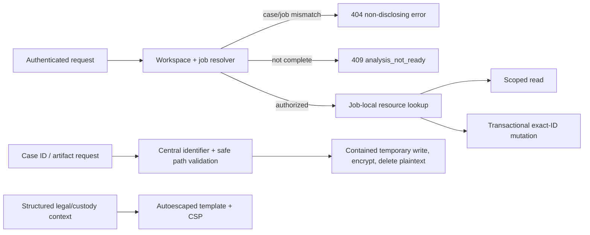

# Netra Phase 1 security remediation runbook

## Scope

This runbook verifies critical containment without touching production or Supabase. Run it from the `codex/netra-security-remediation` branch. Keep the confidential audit PDF untracked.



## Verification procedure

Set the local packet-analysis prerequisites in PowerShell:

```powershell
$env:Path = 'C:\Program Files\Wireshark;' + $env:Path
$env:PYTHONPATH = 'C:\Users\ADMIN\Desktop\hackthon\ml-services\anomaly-engine'
```

Run focused security tests from `backend`:

```powershell
python manage.py test apps.forensics.tests.test_analysis_case_boundaries apps.forensics.tests.test_artifact_security apps.forensics.tests.test_access_control
```

Run the complete backend and model checks:

```powershell
python manage.py test apps.forensics.tests
python manage.py makemigrations --check --dry-run
```

Run frontend checks from `frontend`:

```powershell
npm test -- --run
npm run lint
npm run build
```

Run repository/static checks from the repository root:

```powershell
rg -n --pcre2 "(?<!empty)_analysis\(\)|analysis_for_case\(\)|latest_job_for_case\(\)" backend
git diff --check
git status --short
git log --oneline --decorate -6
```

The static search should return no results. Repository status should show only the intentionally untracked confidential audit PDF after the final commit.

## Failure handling

- Do not commit a failing state.
- A cross-case response other than the expected 404 is a no-go.
- Any failed mutation side effect is a no-go.
- Any plaintext artifact left behind or file outside the temporary Storage root is a no-go.
- Any executable report markup is a no-go.
- If model changes are detected, stop; Phase 1 authorizes no migration.
- If a cloud credential, URL, or object operation appears in logs, stop and investigate; Phase 1 is local-only.

Rollback uses ordinary `git revert` in reverse commit order. Do not use destructive reset commands and do not alter the baseline commit.
