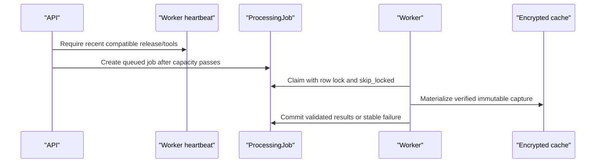

# Netra worker operations runbook

## Deployment contract

The API and worker are separate Railway services built from `backend/Dockerfile` and `backend/Dockerfile.worker`. Both share the reviewed backend secrets and release ID; only the worker receives parser-limit variables. Production uses `postgres-worker`, `postgres-row-lock`, and synchronous fallback disabled.

## Readiness

The worker is ready only when:

- runtime role is `worker`;
- processing mode and queue provider match the production contract;
- its release identifier is present;
- TShark reports exactly 4.6.7;
- Zeek reports exactly 8.2.1;
- persistent cache configuration and permissions are valid;
- heartbeat writes succeed.

The API treats heartbeats older than `NETRA_WORKER_STALE_AFTER_SECONDS` as unavailable. A missing compatible worker blocks new PCAP promotion with `503 analysis_capacity_unavailable`; it never invokes inline processing.

## Safe rollout

1. Rehearse migrations `0014` and `0015` on a disposable PostgreSQL 17 copy.
2. Verify the Railway Hobby memory/CPU budget and persistent `/app/storage` volume before creating services.
3. Deploy the API with writes closed and worker stopped.
4. Confirm API liveness, degraded-safe cache readiness, Auth, and read-only case boundaries.
5. Deploy one worker and confirm its exact capability heartbeat and matching release ID.
6. Submit one small synthetic job; verify a single claim, bounded parser result, custody append, and zero repeat Storage GET.
7. Start additional workers only if approved resource limits require them.
8. Reopen writes only after the cutover checklist passes.

## Incident response

| Symptom | Action |
|---|---|
| Stale/missing heartbeat | Stop new PCAP admission; inspect worker logs and readiness; do not enable synchronous fallback |
| Parser timeout/resource limit | Keep stable job failure; preserve authorized source evidence; review fixture/tool version without exposing stderr |
| Cache unavailable | Keep worker unready; restore volume/permissions; do not bypass cache with repeated Storage GETs |
| Version mismatch | Reject worker; rebuild from pinned sources/checksums; do not relax required versions live |
| Repeated job crash | Stop the affected worker group, retain job/evidence, and investigate locally with sanitized fixtures |
| Custody verification failure | Freeze writes for that case and treat it as an integrity incident; do not repair links silently |

## Egress controls

- Read immutable objects through the verified encrypted cache only.
- A cache hit must perform zero Storage GETs.
- Startup/readiness is metadata-only and never downloads an object.
- Do not run deep probes or crypto migration from worker startup.
- Do not bypass cache capacity/free-space failures.
- Review Supabase Usage before any later migration and retain the 0.75 GB hard migration ceiling.

## Rollback

Before writes reopen, stop the new worker, restore the prior application release/environment references, and follow `CUTOVER_AND_ROLLBACK_CHECKLIST.md`. After writes reopen, never reverse environments without reconciling target-only database and Storage changes under a new write freeze and egress approval.
