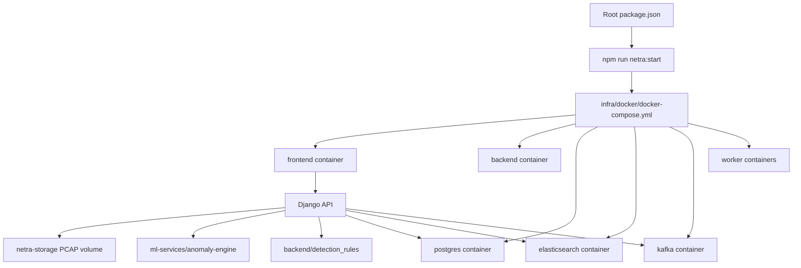
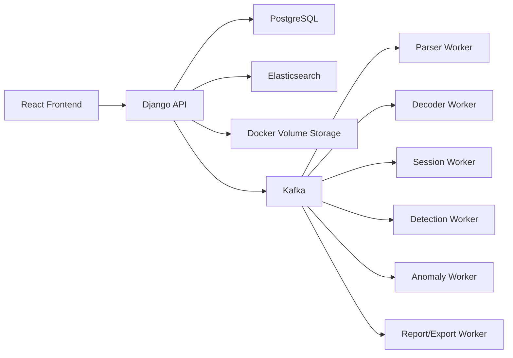
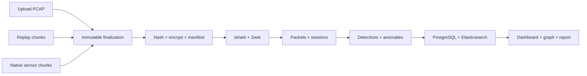

# Netra Architecture

Netra captures, imports, analyzes, visualizes, and reports on network traffic for cybercrime investigation teams. The repo is split by subsystem so the hackathon demo is easy to run and explain.

## Repository Layout

```txt
backend/        Django API, forensic models, packet analysis, worker commands
frontend/       React/Vite UI served by nginx in Docker
ml-services/    Phase 1 AI-assisted anomaly package
sensor-agent/   Native Windows/Linux dumpcap companion
database/       PostgreSQL and Elasticsearch docs/config placeholders
infra/          Docker Compose and PowerShell orchestration scripts
docs/           Architecture, workflow, deployment, Zeek, and PCAP guides
samples/pcaps/  Real PCAP files for demos and validation
storage/        Storage notes; Docker volume holds runtime evidence
```

## Runtime Flow



## Component Flow



## System of Record

PostgreSQL stores investigation records:

- Cases
- Evidence metadata
- Capture and processing jobs
- Alerts
- Detection matches
- Anomaly records
- Reports and exports
- Integrations
- Audit logs
- Compliance records

Elasticsearch is reserved for high-volume search records:

- Packet records
- Protocol decoded records
- Payload findings
- Session timelines
- Alert search documents
- Dashboard analytics records

Docker volumes store:

- Uploaded PCAP files
- Capture chunks
- Generated reports
- Evidence exports
- Analysis logs

## Phase 5 Operational Path

For demo reliability, final PCAP analysis remains synchronous while import,
replay, and native capture converge on immutable evidence finalization:



Operational events are persisted in PostgreSQL and streamed to the browser using
SSE. Workers publish real heartbeats and idempotent stage receipts.
