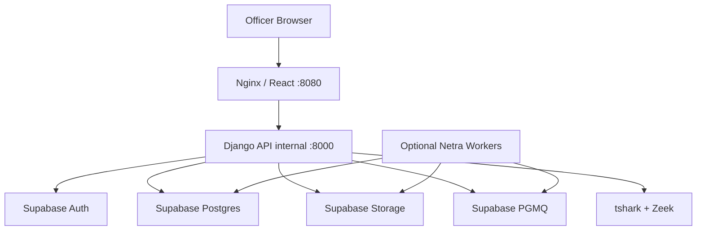
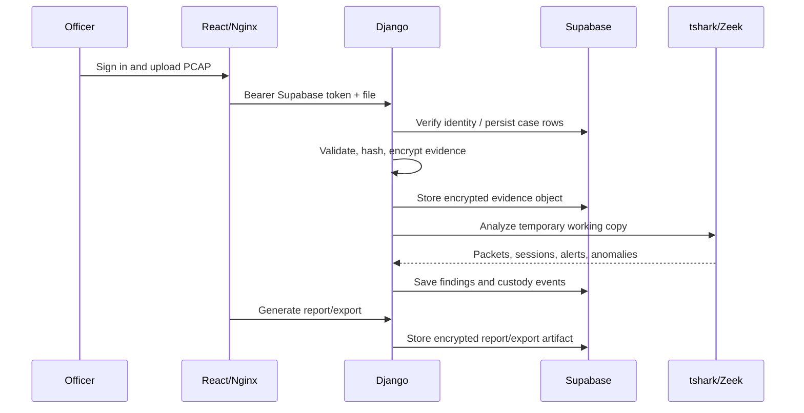

# Netra Production Deployment Readiness

This document describes the Phase 11 deployment profile for Netra in Supabase mode.

Netra production mode still runs Netra compute in containers because `tshark`, Zeek, report generation, and PCAP handling require native binaries. Supabase remains the managed data plane for Auth, Postgres, Storage, Realtime, and PGMQ.

## Target Shape



The production compose file is:

```powershell
infra/docker/docker-compose.supabase.production.yml
```

It intentionally does not start local PostgreSQL, Kafka, or Elasticsearch.

## Production Commands

Create the production env file:

```powershell
Copy-Item .env.supabase.production.example .env.supabase.production.local
```

Fill every placeholder value, then start:

```powershell
npm run netra:start:production
```

Validate deployment readiness:

```powershell
npm run netra:validate:production
```

Run the full Supabase smoke test after setting `SUPABASE_TEST_EMAIL` and `SUPABASE_TEST_PASSWORD`:

```powershell
npm run netra:validate:supabase
```

## Required Secrets

Store these only in `.env.supabase.production.local` or a real secret manager:

| Secret | Purpose | Rotation Trigger |
|---|---|---|
| `SUPABASE_SERVICE_ROLE_KEY` | Backend-only Storage, DB, queue operations | Rotate before shared demo and after any exposure |
| `DJANGO_SECRET_KEY` | Django signing secret | Rotate for every production environment |
| `NETRA_EVIDENCE_KEY` | Netra-side evidence/artifact encryption | Rotate before production; preserve old key for old evidence |
| `NETRA_SENSOR_SHARED_KEY` | Sensor ingestion shared secret | Rotate when a sensor machine is lost or reused |
| `NETRA_WEBHOOK_SIGNING_SECRET` | SIEM/webhook HMAC signing | Rotate if integrations are shared or leaked |
| `DATABASE_URL` password | Supabase Postgres pooler access | Rotate if copied to an untrusted machine |

Never put service-role keys in React, Vite, screenshots, reports, or browser-visible configuration.

## Supabase Hardening Checklist

Before shared deployment:

- Rotate the service-role key that was pasted during development.
- Confirm frontend uses only `VITE_SUPABASE_ANON_KEY`.
- Disable public signup in Supabase Auth unless the project explicitly needs it.
- Review Supabase Auth users and remove test accounts not needed for demo.
- Confirm Storage buckets are private:
  - `netra-evidence`
  - `netra-capture-chunks`
  - `netra-analysis-chunks`
  - `netra-zeek-logs`
  - `netra-reports`
  - `netra-exports`
- Review Supabase RLS/Data API exposure before any public internet deployment.
- Keep `DATABASE_CONN_MAX_AGE=0` for transaction pooler mode.

## Runtime Security

Production compose enforces:

- `DJANGO_DEBUG=0`
- backend port is internal to Docker
- frontend is the only published service
- local PostgreSQL/Kafka/Elasticsearch are not present
- development role headers are disabled
- Supabase Auth is the active auth provider
- CORS must use explicit `NETRA_FRONTEND_ORIGINS`

If deploying behind HTTPS, set:

```env
NETRA_PUBLIC_BASE_URL=https://your-domain.example
NETRA_FRONTEND_ORIGINS=https://your-domain.example
DJANGO_CSRF_TRUSTED_ORIGINS=https://your-domain.example
NETRA_REQUIRE_HTTPS=1
DJANGO_SECURE_PROXY_SSL_HEADER=1
DJANGO_SECURE_HSTS_SECONDS=31536000
```

## Deployment Data Flow



## Smoke Test Flow

Use this sequence before demo or deployment handoff:

1. Start production profile.
2. Open `/login`.
3. Sign in with a manually-created Supabase user.
4. Upload `samples/pcaps/hydra_ssh.pcap`.
5. Verify Case Overview, Suspicious Activity, Traffic Evidence.
6. Generate HTML report.
7. Generate JSON export and alert CSV.
8. Verify custody ledger.
9. Open Technical Status and confirm Supabase Postgres, Storage, Realtime, PGMQ.
10. Run `npm run netra:validate:production`.

## Rollback

Rollback is container-level:

```powershell
npm run netra:stop
docker image ls netra-production*
```

Then restart the previously working image/tag if one was saved by your deployment process.

Supabase data rollback should use Supabase backups/PITR when available. Netra encrypted evidence objects should not be deleted during rollback unless a cleanup plan has been reviewed.

## Backup And Restore Expectations

For Supabase mode:

- Supabase Postgres backups are managed in Supabase.
- Supabase Storage objects should be retained by bucket policy and exported before destructive changes.
- Keep a separate offline copy of:
  - `NETRA_EVIDENCE_KEY`
  - key IDs
  - release ID
  - deployment env file checksum

The legacy local backup scripts remain for local PostgreSQL mode only.

## Known Deployment Boundaries

- Public internet exposure still requires a formal security review.
- RLS policies and Supabase Data API grants must be reviewed before public API exposure.
- Native sensor capture depends on Wireshark/Npcap or Linux capture permissions.
- Detection/anomaly logic remains explainable and heuristic; it is not a certified malware attribution engine.
