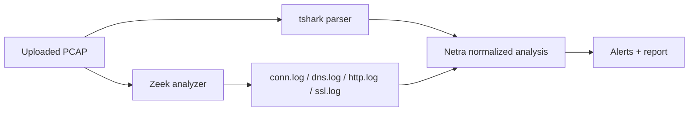

# Zeek Setup Guide

Zeek converts PCAP files into structured forensic logs. Wireshark is best for manual packet inspection; Zeek is best for repeatable evidence extraction.

Netra installs Zeek inside the backend container. The upload analysis path uses `tshark` for packet metadata and Zeek for structured protocol evidence.

Check Zeek availability:

```powershell
curl.exe -s http://localhost:8000/api/health
```

The response should include:

```json
"zeek": true
```

Run Zeek through the Netra backend container:

```powershell
npm run zeek:sample
```

Or choose a PCAP:

```powershell
powershell -ExecutionPolicy Bypass -File .\infra\scripts\run-zeek-sample.ps1 -Pcap "samples\pcaps\zeus.pcap"
```

## Docker-based Zeek

If local Windows setup is difficult, you can also use the standalone Zeek Docker image:

```powershell
docker pull zeek/zeek:latest
```

Run Zeek on a sample PCAP:

```powershell
docker run --rm -v "${PWD}\samples\pcaps:/pcaps" -v "${PWD}\storage\zeek:/zeek-logs" zeek/zeek:latest zeek -C -r /pcaps/hydra_ssh.pcap Log::default_logdir=/zeek-logs
```

Expected logs may include:

```txt
conn.log
dns.log
http.log
ssl.log
files.log
notice.log
```

The exact logs depend on traffic inside the PCAP. The `-C` flag is useful for offline PCAP analysis because many captures contain checksum-offload artifacts from the capture host.

## Why Zeek Helps Netra

Zeek can provide:

- Connection summaries
- DNS records
- HTTP request metadata
- TLS/SSL metadata
- File transfer observations
- Notices for suspicious behaviors

## Planned Netra Integration



Phase 2 persists Zeek summaries and indexed Zeek evidence so historical investigations can search protocol logs by case.
