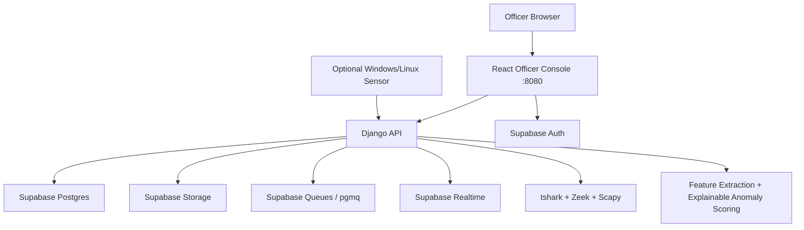
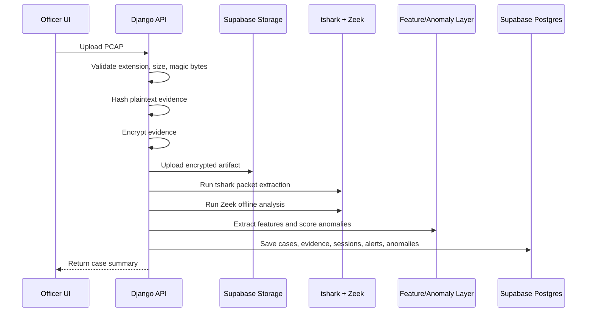
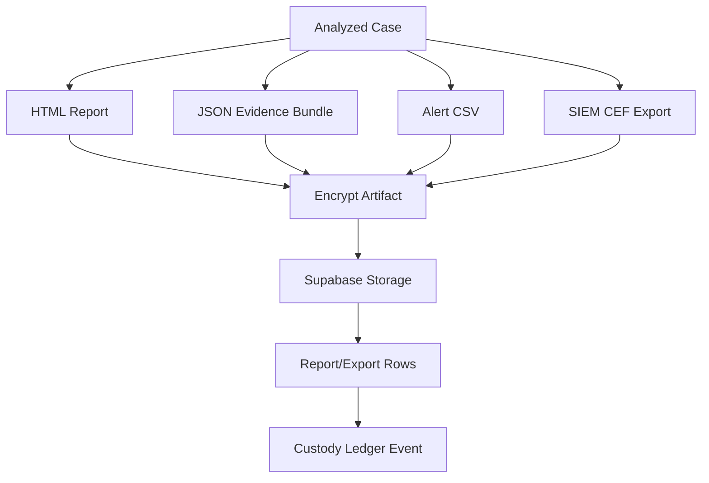

# Netra Full Technical Audit Report

Generated: 2026-06-16 12:50:30

Scope: Netra officer-facing network and packet forensics platform, measured against the Cyber Crime Branch network-forensics problem statement. This report is based on source-code inspection, live local API health snapshots, Supabase validation output, and frontend/backend pipeline mapping. Secrets, passwords, service-role keys, JWTs, and raw PCAP payloads are intentionally excluded.

## 1. Executive Summary

Netra is currently a working officer-facing forensic prototype with a strong stored-PCAP workflow. The main validated flow is:

```text
Sign in -> Upload PCAP -> Analyze automatically -> Review suspicious activity -> Inspect traffic evidence -> Generate report/export
```

Current architecture uses React for the officer console, Django for the API and packet-processing orchestration, Supabase Auth/Postgres/Storage/Realtime/Queues for the data plane, and native packet tooling (`tshark`, Zeek, Scapy) for forensic extraction. The ML layer is transparent ML-lite: deterministic feature extraction plus explainable anomaly scoring. It does not currently claim to be a supervised deep-learning zero-day classifier.

Readiness ratings:

| Area | Rating | Reason |
| --- | --- | --- |
| Prototype/demo readiness | Ready for stored-PCAP demo | Authenticated upload, analysis, report, exports, custody, and integrity verification passed validation. |
| Officer usability readiness | Good demo readiness | Simplified navigation and upload-first flow are present. |
| Forensic evidence readiness | Usable with supervision | Hashing, encryption, manifest, custody, and exports exist; legal admissibility needs review. |
| Production readiness | Not production-ready | Needs RLS/security hardening, key rotation, detection benchmarking, worker validation, live capture validation, and monitoring. |

Top completed capabilities: Supabase login, authenticated API calls, Supabase Postgres/Storage/pgmq/Realtime health, PCAP upload, tshark/Zeek processing, packet/session/alert persistence, report generation, JSON/CSV exports, integrity verification, and custody verification.

Top remaining gaps: replay finalization failed validation, sensor capture remains advanced and environment-dependent, workers are offline by default, SIEM/webhook flow was not validated in the latest run, and ML/detection accuracy needs a larger benchmark corpus.

## 2. Requirement Traceability Matrix

| Requirement | Current Status | Evidence in Project | Notes / Gaps | Production Readiness |
| --- | --- | --- | --- | --- |
| Live network capture | Advanced-only / Partial | Sensor APIs and native agent exist; latest full validation stopped before sensor tests. | Needs environment validation with Npcap/dumpcap and permissions. | Not production-ready |
| Stored PCAP import | Working | Supabase validator passed authenticated PCAP upload and packet analysis. | Primary reliable demo path. | Ready for demo |
| High-throughput processing | Partial | MAX_PACKETS demo cap and optional workers/pgmq queues exist. | Needs large-corpus benchmarks and worker hardening. | Partial |
| Filtering by IP/protocol/port | Working | Upload/search filters and Postgres-backed packet APIs are present. | Officer UI keeps advanced filters collapsed. | Ready for demo |
| DPI/protocol decoding | Working / metadata-level | tshark and Zeek are available and healthy. | No TLS payload decryption claimed. | Usable with supervision |
| Payload inspection | Partial | Payload clue metadata exists. | Not full payload reconstruction. | Partial |
| Encrypted traffic analysis | Working / metadata-only | Protocol, timing, DNS, session, and byte features are used. | Encrypted payload content is not decrypted. | Ready for demo |
| Session reconstruction | Working | Validator confirms packet/session analysis after upload. | Large captures need benchmarks. | Ready for demo |
| Signature/behavior detection | Working | Hydra upload generated credential brute force finding. | Heuristics require broader validation. | Usable with supervision |
| Malware/botnet/exfiltration/tunnel detection | Partial | Rule/heuristic categories exist. | Needs wider corpus accuracy testing. | Partial |
| AI anomaly detection | Working / ML-lite | Feature extraction and explainable scoring modules exist. | Not a trained deep-learning classifier. | Ready for demo |
| Traffic graph visualization | Working | Communication map derives from sessions and alerts. | Not graph-database scale. | Ready for demo |
| Timeline correlation | Working | Packet/alert timestamps drive timeline views. | Correlation depth can improve. | Ready for demo |
| Case management | Working | Supabase DB has case/evidence/job/report tables. | Advanced lifecycle workflows remain limited. | Ready for demo |
| Evidence export/reporting | Working | Validator passed report, JSON export, alert CSV, and downloads. | Legal format review still needed. | Ready for demo |
| Chain of custody | Working | Validator passed custody ledger verification. | Requires legal admissibility review. | Usable with supervision |
| SIEM integration | Partial | CEF/webhook implementation exists. | Latest full validator stopped before webhook/CEF checks. | Partial |
| Dashboard/analytics | Working | Summary APIs and officer pages return data/empty states. | Operational dashboards can deepen. | Ready for demo |
| Secure storage | Working | Deep health reports Supabase Storage OK; validator passed artifact flows. | Rotate exposed keys before shared demo. | Usable with supervision |
| Access logs | Working | Access/custody models and actions are present. | Audit coverage needs review. | Usable with supervision |
| RBAC | Partial | Supabase Auth protects app; detailed roles are not current UI default. | Problem statement asks RBAC; implement if moving beyond controlled demo. | Partial |
| Cloud/serverless data plane | Working / hybrid | Supabase handles Auth/Postgres/Storage/Realtime/Queues. | Django containers still required for tshark/Zeek compute. | Ready for demo |

## 3. Current System Architecture



Supabase is the current default data plane in Supabase mode. Local PostgreSQL, Kafka, and Elasticsearch remain legacy/developer alternatives, not the current primary architecture. Docker still runs frontend/backend because `tshark`, Zeek, merge tools, encryption, and analysis workers need container/managed compute; Supabase Edge Functions are not appropriate for heavy PCAP parsing.

Live health snapshot:

| Component | Status | Detail |
| --- | --- | --- |
| Overall deep health | degraded | Degraded because workers are offline/disabled, while core Supabase path is OK. |
| Postgres | ok | Latency: 1108.39 ms |
| Storage | ok | bucket list and encrypted artifact probe succeeded |
| Queue | ok | pgmq send/read/archive probe succeeded |
| Realtime | ok | Missing tables: [] |
| Packet tools | ok | scapy=True, tshark=True, zeek=True |
| Workers | degraded | Offline workers: 11 |

Database mode: `supabase`. Database provider: `supabase`. Table count: `46`. Search provider from index API: `postgres`. Queue provider: `supabase-pgmq`. Queue depths: `alerts-created: 0, analysis-chunk-ready: 0, analysis-finalize: 0, anomaly-events: 0, capture-chunk-received: 0, dead-letter: 0, export-completed: 7, features-ready: 0, operational-events: 4, packets-normalized: 0, pcap-uploaded: 10, protocol-decoded: 0, report-export: 10, sessions-reconstructed: 0`.

## 4. Frontend Page Audit

| Page | Purpose | Data Source / API | Current Status |
| --- | --- | --- | --- |
| Login | Supabase Auth sign-in, no public signup. | Supabase Auth token -> backend Bearer token. | Working |
| Start Investigation | Upload-first PCAP intake with advanced filters collapsed. | POST /api/evidence/upload. | Working |
| Case Overview | Risk, top finding, counts, hash status, next step. | Dashboard/case summary APIs. | Working with real upload data |
| Suspicious Activity | Alerts, anomalies, suspicious flows, recommendations. | Alerts/anomalies/session APIs. | Working with real upload data |
| Traffic Evidence | Packets, sessions, protocols, payload clues, communication map. | Case-scoped packets/sessions/decoder/search APIs. | Working; payload is metadata-level |
| Evidence Report | HTML report, JSON bundle, CSV, CEF, integrity/custody. | Report/export/integrity endpoints. | Working for report/JSON/CSV; SIEM partial |
| Cases | Historical persisted investigations. | GET /api/cases. | Working |
| Technical Status | Supabase health, queues, realtime, packet tools, worker state. | System health APIs. | Working |
| Advanced sensor/replay | Native capture and replay feed tools. | Sensor/capture/replay APIs. | Partial; replay validation failed |

Officer workflow is intentionally simplified. Technical pages such as Packet Explorer, Sessions, Protocol Decoder, Payload Inspection, Threat Detection, AI Anomaly, Network Graph, Retention, Integrations, and System diagnostics are not first-level officer navigation. They are grouped into officer-facing pages or advanced/operator sections.

## 5. Backend/API Audit

| Subsystem | Primary Files | Responsibility |
| --- | --- | --- |
| Supabase auth verification | backend/common/supabase_auth.py, backend/apps/forensics/views.py | Validates Supabase access tokens and resolves actors. |
| Evidence upload | backend/apps/forensics/views.py:evidence_upload | Validates PCAP, hashes/encrypts, uploads to Storage, analyzes, persists. |
| Analysis pipeline | backend/common/analysis.py:analyze_pcap | Runs tshark, Zeek, sessions, detections, graph, timeline, report preview. |
| Storage provider | backend/common/storage_provider.py | Supabase private bucket provider with local compatibility. |
| Persistence | backend/common/persistence.py | Converts analysis output into case/evidence/job/alert/session/anomaly rows. |
| Reports/exports | backend/common/artifacts.py, backend/apps/forensics/views.py | Builds HTML report, JSON bundle, alert CSV, CEF export. |
| Custody | backend/common/custody.py | Hash-linked custody ledger and verification. |
| Queue provider | backend/common/kafka.py | Supabase pgmq path replaces Kafka in Supabase mode. |

The backend acts as the trusted processing boundary. The browser authenticates with Supabase Auth, but raw PCAP handling, hashing, encryption, Storage uploads, analysis, report generation, and downloads go through Django. This prevents the frontend from directly uploading raw evidence or reading private storage objects.

## 6. PCAP Processing and Analysis Pipeline



Supported historical evidence types are `.pcap` and `.pcapng`. The stored upload path validates file extension, file size, and PCAP magic/header behavior before analysis. The current packet extraction cap is `MAX_PACKETS = 5000`, which is appropriate for a hackathon/officer demo but should be benchmarked for larger investigations.

Outputs include packet metadata, session summaries, protocol/Zeek summaries, payload clues, alerts, anomaly records, graph edges, timeline points, report previews, manifests, and custody events.

The system does not claim TLS payload decryption, complete payload reconstruction, or a trained deep-learning classifier. Payload inspection is currently metadata/clue-based. Zeek failure is treated tolerantly so that a demo can still proceed with tshark-derived evidence.

## 7. ML and Anomaly Services Audit

The ML-like layer is in `ml-services/anomaly-engine/netra_ml/`.

| Module | What it does | Current Truth |
| --- | --- | --- |
| features.py | Extracts host, service, DNS, timing, beacon-like, traffic-volume, and Zeek-derived features. | Working source module used by analysis flow. |
| scoring.py | Scores explainable anomalies from feature thresholds and observed behavior. | Deterministic ML-lite scoring, not a trained production model. |
| explanations.py | Maps behavior hypotheses to human-readable recommended actions. | Useful for officer-facing explanations and reports. |

This transparency is a strength for forensic explainability, but it is not enough for production accuracy claims. The next maturity step is a validation corpus with measured precision, recall, false-positive rate, and analyst feedback.

## 8. Threat Detection Audit

Current detection is a combination of rule files, packet/session features, Zeek evidence, and behavior heuristics. Covered behaviors include credential brute force, scanning/botnet-like behavior, C2/beaconing indicators, DNS/ICMP tunneling indicators, data exfiltration indicators, service exploitation, RCE-like behavior, SMB/NetBIOS lateral movement indicators, and suspicious SMTP transfer.

Each alert is expected to carry attack class, severity, confidence, explanation, evidence packet/session IDs, and recommended action. The latest validation proved a credential-brute-force style finding from a real uploaded PCAP. Broader attack-class claims should be treated as partial until validated against a larger dataset.

Important forensic limitation: PCAP-only evidence can show repeated SSH service access, timing, endpoints, bytes, and flows. It cannot by itself prove login success or failure without server authentication logs.

## 9. Supabase Data Plane Audit

Supabase handles Auth, Postgres, Storage, Realtime, Queues/pgmq, and transaction-pooler access. Current database table count is `46`.

Major forensics tables:

```text
forensics_accesslog, forensics_alert, forensics_analysischunk, forensics_analysisstageresult, forensics_anomalyrecord, forensics_capturechunk, forensics_capturejob, forensics_captureschedule, forensics_case, forensics_casehistoryevent, forensics_casemembership, forensics_compliancecontrol, forensics_custodyledgerevent, forensics_deadletterevent, forensics_detectionmatch, forensics_evidencefile, forensics_evidencemanifest, forensics_export, forensics_integrationconnection, forensics_integrationcredential, forensics_integrationdelivery, forensics_operationalevent, forensics_processingjob, forensics_report, forensics_retentioncandidate, forensics_retentionpolicy, forensics_retentionrun, forensics_sensor, forensics_sensorcommand, forensics_sensorgroup, forensics_sensorhealthsnapshot, forensics_sessionsummary, forensics_userprofile, forensics_workerheartbeat, forensics_workerstagereceipt, forensics_zeeklogsummary
```

Realtime status: `ok`. Expected operational tables are configured, with missing tables: `[]`. Queue status: `ok`, provider `supabase-pgmq`.

Security notes: the service-role key must never be shipped to frontend code. Because service credentials were exposed during development conversation, rotate the service-role key before any shared or judged deployment. Supabase RLS and Storage policies should be reviewed before public production.

## 10. Report, Export, Custody, and Legal Evidence Flow



The validator passed HTML report generation/download, JSON evidence export generation/download, alert CSV export generation, evidence integrity verification, and custody ledger verification. Artifacts are encrypted before upload to private Supabase Storage buckets. Downloads go through backend routes rather than direct public object URLs.

The evidence manifest contains plaintext identity hash, encrypted storage hash, key ID, storage URI, and manifest hash. Integrity verification recalculates encrypted artifact hash and validates the manifest path. Legal admissibility is promising for a demo, but final court-readiness requires review by the intended authority.

## 11. Sensor Capture and Replay Audit

Stored PCAP upload is the primary reliable workflow. Sensor capture and replay are advanced operational paths.

The native sensor agent is designed to use Windows Wireshark `dumpcap.exe` with Npcap and Linux `dumpcap`/`tcpdump`, register with the API, send heartbeat, poll commands, upload capture chunks, and finalize bounded captures into the same evidence pipeline.

Latest validation result: replay finalization failed. The replay job remained `running` and did not produce final evidence within the validator window. Therefore replay and sensor capture should be represented as partial/advanced until separately fixed and validated.

## 12. Visualization and Charts Audit

Charts and visual summaries are derived from case-scoped analysis records:

- Protocol distribution: packet protocol counts.
- Timeline: packet timestamps, alert timestamps, and operational events.
- Communication map: session source/destination edges, risk scores, and alert links.
- Suspicious nodes/edges: endpoints associated with high-risk sessions or alerts.
- Dashboard cards: summary APIs over packets, sessions, alerts, anomalies, and evidence status.
- Traffic Evidence tabs: packets, sessions, protocol evidence, payload clues, and map data.

This is officer-friendly case visualization, not a graph database or Kibana-scale analytics environment.

## 13. Testing and Validation Report

Validation command:

```powershell
npm run netra:validate:supabase
```

| Result | Scenario | Detail |
| --- | --- | --- |
| PASS | API health is reachable | Validated by script |
| PASS | Supabase database provider and tables are visible | Validated by script |
| PASS | deep health reports Supabase Postgres, Storage, and PGMQ | Validated by script |
| PASS | search endpoint uses Supabase/Postgres, not Elasticsearch | Validated by script |
| PASS | queue endpoint uses Supabase PGMQ, not Kafka | Validated by script |
| PASS | Supabase Realtime publication is configured for operational tables | Validated by script |
| PASS | Supabase compose excludes local PostgreSQL, Kafka, and Elasticsearch services | Validated by script |
| PASS | configured Supabase test login works | Validated by script |
| PASS | authenticated PCAP upload completed | Validated by script |
| PASS | uploaded case produced packet analysis | Validated by script |
| PASS | evidence integrity verification completed | Validated by script |
| PASS | report generation completed | Validated by script |
| PASS | report download completed | Validated by script |
| PASS | evidence export generation completed | Validated by script |
| PASS | evidence export download completed | Validated by script |
| PASS | alert CSV export generation completed | Validated by script |
| PASS | custody ledger verifies report/export/integrity actions | Validated by script |
| FAIL | Replay finalization | Replay job stayed running and did not produce final evidence within the validator window. |

Frontend build:

```text
> hackthon@0.0.0 build
> tsc -b && vite build

vite v8.0.14 building client environment for production...

transforming...✓ 2951 modules transformed.
rendering chunks...
computing gzip size...
dist/index.html                     0.45 kB │ gzip:   0.29 kB
dist/assets/index-Cc6W3Nuk.css     52.05 kB │ gzip:   9.77 kB
dist/assets/index-BDfpznLN.js   1,415.49 kB │ gzip: 407.94 kB

✓ built in 1.66s
[plugin builtin:vite-reporter] 
(!) Some chunks are larger than 500 kB after minification. Consider:
- Using dynamic import() to code-split the application
- Use build.rolldownOptions.output.codeSplitting to improve chunking: https://rolldown.rs/reference/OutputOptions.codeSplitting
- Adjust chunk size limit for this warning via build.chunkSizeWarningLimit.
```

Python compile checks passed for the inspected backend and ML modules. The latest validation result means the stored-PCAP officer demo is strong, while replay remains blocked.

## 14. Production Readiness Assessment

| Category | Assessment | Reason |
| --- | --- | --- |
| Officer usability | Ready for demo | Simplified login and upload-first pages exist. |
| PCAP analysis correctness | Usable with supervision | tshark/Zeek pipeline works, but broader datasets are needed. |
| Detection accuracy | Partial | Explainable heuristics work, but no formal benchmark corpus yet. |
| Evidence security | Usable with supervision | Encryption, private Storage, manifests, and backend downloads exist. |
| Chain of custody | Usable with supervision | Hash-linked events verify; legal review still needed. |
| Supabase data plane | Ready for demo | Auth/Postgres/Storage/pgmq/Realtime health checks pass. |
| Report/export | Ready for demo | Report, JSON export, CSV export, and downloads validated. |
| Live capture | Partial | Advanced source exists; latest validation did not prove operational capture. |
| SIEM integration | Partial | CEF/webhook code exists; latest full validation stopped before proving it. |
| Scalability | Partial | Packet cap and sync path are demo-oriented. |
| Public deployment | Not production-ready | Needs RLS hardening, key rotation, policies, monitoring, and legal review. |
| Legal admissibility | Partial | Evidence practices exist but require authority/legal validation. |

## 15. Gap and Risk Register

| Gap/Risk | Severity | Impact | Current Mitigation | Recommended Fix |
| --- | --- | --- | --- | --- |
| Replay finalization blocked | High | Advanced demo replay cannot currently be claimed complete. | Validator catches failure. | Debug replay chunk upload/finalize path first. |
| Worker fleet offline by default | Medium | Deep health is degraded and async path is not the primary validated path. | Synchronous upload path works. | Enable/validate workers only after stable demo. |
| Service-role key exposure history | High | Shared demo could be compromised if old key remains valid. | Secrets are not in frontend/report. | Rotate service-role key before any shared deployment. |
| Detection corpus limited | High | Accuracy claims cannot be production-grade. | Explainable heuristics and evidence IDs. | Build benchmark corpus and publish precision/recall. |
| Payload inspection limited | Medium | DPI expectations may exceed metadata-level implementation. | Report states no TLS decryption/full reconstruction. | Add protocol-specific extractors and safe payload handling. |
| RLS/RBAC not production-hardened | High | Supabase project should not be public-production exposed yet. | App requires Auth. | Review RLS, session policy, storage policy, and least privilege. |
| Legal admissibility unreviewed | High | Court-readiness needs authority validation. | Hashing, encryption, custody ledger. | Legal review of report format and custody process. |
| Large PCAP scalability | Medium | Current demo uses packet cap and sync path. | MAX_PACKETS cap visible. | Benchmark large PCAP/chunk processing. |

## 16. Delivery Match Against Problem Statement

| Deliverable / Evaluation Area | Current Match | Notes |
| --- | --- | --- |
| Working prototype/demo | Yes | Stored-PCAP workflow is validated end-to-end. |
| Packet analysis dashboard | Yes | Case overview, suspicious activity, and traffic evidence pages exist. |
| Threat detection demonstration | Yes | Credential brute force finding validated; broader classes need corpus testing. |
| Forensic report sample | Yes | Report generation and download passed validation. |
| Documentation | Good but evolving | Architecture and phase docs exist; this audit adds current truth. |
| Containerized/cloud-ready setup | Yes / hybrid | Docker compute plus Supabase data plane. |
| Live/simulated traffic | Partial | Replay failed latest validation; native sensor capture remains advanced. |
| Secure evidence handling | Good for demo | Encryption, manifests, custody, private Storage; key rotation required. |
| SIEM integration | Partial | Basic implementation; latest validation did not prove delivery. |
| Cloud/serverless data plane | Yes | Supabase is active for Auth/Postgres/Storage/Queues/Realtime. |

## 17. File Reference Map

| Area | Project Files |
| --- | --- |
| Frontend app shell and pages | frontend/src/App.tsx |
| Supabase frontend client | frontend/src/lib/supabase.ts |
| Frontend data types | frontend/src/lib/types.ts |
| Visual styling | frontend/src/index.css |
| Backend routing | backend/apps/forensics/urls.py |
| Backend API views | backend/apps/forensics/views.py |
| Forensics data models | backend/apps/forensics/models.py |
| Django/Supabase settings | backend/config/settings.py |
| PCAP analysis | backend/common/analysis.py |
| PCAP validation helpers | backend/common/pcap.py |
| Encryption/vault | backend/common/vault.py |
| Persistence service | backend/common/persistence.py |
| Artifact/report service | backend/common/artifacts.py |
| ML features | ml-services/anomaly-engine/netra_ml/features.py |
| ML scoring | ml-services/anomaly-engine/netra_ml/scoring.py |
| ML explanations | ml-services/anomaly-engine/netra_ml/explanations.py |
| Sensor agent | sensor-agent/netra_sensor/*.py |

Selected function references from source scan:

```text
ml-services\anomaly-engine\netra_ml\explanations.py:8:def recommended_action(behaviour: str, hypothesis: str) -> str:
ml-services\anomaly-engine\netra_ml\features.py:30:def extract_features(packets: list[dict[str, Any]], sessions: list[dict[str, Any]], zeek: dict[str, Any] | None = None, filename: str = "") -> dict[str, Any]:
ml-services\anomaly-engine\netra_ml\scoring.py:8:def score_anomalies(features: dict[str, Any], sessions: list[dict[str, Any]], alerts: list[dict[str, Any]], filename: str = "") -> list[dict[str, Any]]:
backend\common\analysis.py:87:def analyze_pcap(pcap_path: str | Path, case_id: str, evidence_id: str, job_id: str, saved: dict[str, Any]) -> dict[str, Any]:
backend\common\analysis.py:225:def run_zeek_analysis(pcap_path: Path, job_id: str) -> dict[str, Any]:
backend\common\analysis.py:388:def _build_detections(packets: list[dict[str, Any]], sessions: list[dict[str, Any]], features: dict[str, Any], zeek: dict[str, Any], filename: str) -> tuple[list[dict[str, Any]], list[dict[str, Any]]]:
backend\common\analysis.py:643:def _build_graph(sessions: list[dict[str, Any]], alerts: list[dict[str, Any]], features: dict[str, Any]) -> dict[str, Any]:
backend\common\analysis.py:718:def build_report_html(analysis: dict[str, Any], language: str = "en") -> str:
backend\apps\forensics\views.py:155:def auth_login(request):
backend\apps\forensics\views.py:450:def evidence_upload(request):
backend\apps\forensics\views.py:570:def capture_live_start(request):
backend\apps\forensics\views.py:632:def capture_replay_start(request):
backend\apps\forensics\views.py:1138:def system_health_deep(_request):
backend\apps\forensics\views.py:1211:def system_realtime(_request):
backend\apps\forensics\views.py:1659:def report_generate(request, case_id: str):
backend\apps\forensics\views.py:1700:def exports(request):
backend\apps\forensics\views.py:1915:def siem_export(request):
backend\common\kafka.py:83:def publish_supabase_queue(topic: str, payload: dict[str, Any], key: str | None = None) -> bool:
backend\common\storage_provider.py:76:class SupabaseStorageProvider(LocalFilesystemStorageProvider):
backend\apps\forensics\management\commands\bootstrap_search.py:8:class Command(BaseCommand):
backend\apps\forensics\management\commands\bootstrap_kafka.py:23:class Command(BaseCommand):
backend\apps\forensics\management\commands\run_netra_retention.py:11:class Command(BaseCommand):
backend\apps\forensics\management\commands\bootstrap_supabase.py:32:class Command(BaseCommand):
backend\apps\forensics\management\commands\run_netra_scheduler.py:11:class Command(BaseCommand):
backend\apps\forensics\management\commands\run_netra_worker.py:45:class Command(BaseCommand):
```

## 18. Data Model and Persistence Map

| Concept | Table / Model | Produced By | Consumed By |
| --- | --- | --- | --- |
| Case | forensics_case | Created on upload/capture/replay. | Case Overview, Cases, Reports, Traffic Evidence. |
| Evidence file | forensics_evidencefile | Created after evidence is validated, hashed, encrypted, and stored. | Manifest, reports, downloads, custody. |
| Evidence manifest | forensics_evidencemanifest | Created after encrypted artifact upload. | Integrity verification and legal evidence package. |
| Processing job | forensics_processingjob | Created for upload/capture/replay analysis. | Upload progress, Technical Status, validation. |
| Session summary | forensics_sessionsummary | Generated from packet five-tuples and flow aggregation. | Traffic Evidence sessions and graph. |
| Alert | forensics_alert | Generated by behavior/rule detectors. | Suspicious Activity, reports, CSV/CEF export. |
| Detection match | forensics_detectionmatch | Records lower-level rule/detector matches. | Advanced details and traceability. |
| Anomaly record | forensics_anomalyrecord | Generated by explainable feature scoring. | Suspicious Activity and report anomaly section. |
| Zeek summary | forensics_zeeklogsummary | Generated by offline Zeek run where available. | Protocol Decoder, report tool summary. |
| Report | forensics_report | Generated by report endpoint/worker. | Evidence Report download list. |
| Export | forensics_export | Generated by JSON/CSV/CEF export endpoints. | Export history and downloads. |
| Custody event | forensics_custodyledgerevent | Created for upload, analysis, report, export, verify, download. | Compliance and legal evidence trail. |
| Access log | forensics_accesslog | Created around protected actions. | Audit/compliance review. |
| Operational event | forensics_operationalevent | Created for queue/replay/capture/job status changes. | Realtime updates and Technical Status. |
| Sensor/capture records | forensics_sensor, forensics_capturejob, forensics_capturechunk | Created by advanced sensor/replay paths. | Advanced capture screens and future live ops. |

This map matters because the project is no longer a mock UI. The officer pages read persisted Supabase rows that are created by upload, analysis, report, export, integrity, and custody actions. Empty pages are expected when no real evidence has been uploaded.

## 19. Public API Map

| Endpoint | Page / Module | Purpose | Status |
| --- | --- | --- | --- |
| POST /api/auth/login | Login | Supabase Auth sign-in wrapper. | Working |
| GET /api/cases | Cases | Lists persisted cases from Supabase Postgres. | Working |
| GET /api/dashboard/summary | Case Overview | Risk, counts, top finding, summaries. | Working |
| POST /api/evidence/upload | Start Investigation | Validates, encrypts, stores, analyzes PCAP. | Working for stored PCAP |
| GET /api/packets | Traffic Evidence | Postgres-backed packet metadata search/filter. | Working |
| GET /api/sessions | Traffic Evidence | Session summaries and flow metadata. | Working |
| GET /api/alerts | Suspicious Activity | Alert list by case/status/severity. | Working |
| GET /api/anomalies | Suspicious Activity | Explainable anomaly records. | Working after analysis |
| GET /api/decoder/summary | Traffic Evidence | Protocol and Zeek summary evidence. | Working after analysis |
| GET /api/graph | Traffic Evidence | Communication map from sessions/alerts. | Working |
| POST /api/reports/:caseId/generate | Evidence Report | Creates encrypted HTML report artifact. | Validated |
| POST /api/exports | Evidence Report | Creates JSON/CSV/CEF style exports. | Validated for JSON/CSV |
| POST /api/evidence/:id/verify-integrity | Evidence Report | Verifies encrypted artifact and manifest. | Validated |
| GET /api/system/health/deep | Technical Status | Supabase/tools/workers deep health. | Working; degraded due offline workers |
| GET /api/system/realtime | Technical Status | Realtime publication status. | Working |
| GET /api/system/kafka | Technical Status | Supabase pgmq status in Supabase mode. | Working |
| POST /api/capture/replay/start | Advanced Replay | Streams a selected PCAP through replay path. | Failed latest finalization validation |
| POST /api/capture/live/start | Advanced Capture | Starts bounded sensor capture. | Partial / environment-dependent |
| POST /api/integrations/:id/test | Advanced Integrations | Webhook test delivery. | Implemented, not latest validated |

The API is intentionally backend-centric. Supabase Auth identifies the user, but Django remains the enforcement and processing boundary for evidence handling, tool execution, encryption, downloads, report generation, and audit events.

## 20. Detailed Processing Stage Matrix

| Stage | Operation | Forensic Purpose | Status |
| --- | --- | --- | --- |
| 1. Intake | Browser sends file to Django with Supabase token. | Reject unauthenticated or invalid request. | Working |
| 2. Validation | Check extension, size, PCAP/PCAPNG magic/header. | Reject bad extension, fake PCAP, oversize. | Working in backend |
| 3. Hashing | Calculate plaintext SHA-256 before encryption. | Establish forensic identity. | Working |
| 4. Encryption | Encrypt evidence artifact before long-term storage. | Avoid storing raw PCAP in Supabase Storage. | Working |
| 5. Storage | Upload encrypted artifact to private Supabase bucket. | Prevent public object access. | Working and health-checked |
| 6. Temporary analysis copy | Materialize a working plaintext copy only for tools. | Remove after analysis; avoid permanent plaintext. | Working by design |
| 7. Packet extraction | Run tshark over working copy, bounded by packet cap/filters. | Generate packet metadata. | Working |
| 8. Zeek analysis | Run Zeek offline logs with tolerant failure. | Generate protocol/service evidence. | Working; tolerant |
| 9. Session reconstruction | Aggregate flows into session summaries. | Support timeline, graph, suspicious flows. | Working |
| 10. Feature extraction | Compute host/service/DNS/timing/Zeek features. | Input to anomaly and detection scoring. | Working |
| 11. Detection | Apply behavior/signature rules and evidence scoring. | Create alerts and matches. | Working |
| 12. Anomaly scoring | Produce explainable anomaly records. | Give confidence, top features, recommendations. | Working |
| 13. Persistence | Write cases, evidence, packets, sessions, alerts, anomalies. | Supabase Postgres is source of truth. | Working |
| 14. Reporting | Generate report/export artifacts on demand. | Legal evidence package and downloads. | Validated |

The most important design choice is that raw uploaded evidence does not become a public frontend object. The backend validates, hashes, encrypts, stores, analyzes a temporary working copy, and records custody. This is the correct direction for a forensic product, even though the implementation still needs production hardening.

## 21. Detection and Anomaly Method Detail

| Detection Area | Signals Used | Example Output | Current Confidence |
| --- | --- | --- | --- |
| Credential brute force | Repeated auth-service access, SSH concentration, sessions per source/destination. | Credential Brute Force | Validated in latest upload case. |
| Scanning / botnet-like behavior | Destination fan-out, port fan-out, repeated probing, service spread. | Botnet / Scanning | Implemented; needs broader validation. |
| C2 / beaconing | Timing regularity, repeated external service contacts, low-variance intervals. | Malware C2 / Beaconing | Heuristic; benchmark needed. |
| DNS tunneling indicators | Long DNS labels, unusual query volume, entropy-like metadata. | Covert Channel / DNS Tunnel | Metadata-level only. |
| ICMP tunneling indicators | ICMP volume and payload-size clues. | Covert Channel / ICMP Tunnel | Metadata-level only. |
| Data exfiltration | High outbound bytes, unusual destination, protocol context. | Data Exfiltration | Needs environment baseline. |
| Lateral movement | SMB/NetBIOS/service access and internal fan-out. | Lateral Movement | Heuristic. |
| Suspicious SMTP transfer | SMTP sessions, transfer size, endpoint context. | Suspicious Transfer | Heuristic. |

| Feature Family | Observed Inputs | Why It Matters |
| --- | --- | --- |
| Host features | Packets/bytes per host, internal/external direction, source/destination concentration. | Detects unusual talkers and data movement. |
| Service features | Ports, protocols, service fan-out, auth-service repetition. | Detects brute force and scanning-like behavior. |
| DNS features | Query volume, label length, query patterns. | Detects tunneling/covert-channel clues. |
| Timing features | Inter-arrival patterns, repeated intervals, beacon-like rhythm. | Detects C2/beacon hypotheses. |
| Zeek-derived features | Services, DNS/connection summaries, external hosts. | Adds protocol-level context. |
| Alert feedback | Existing alert classes and severity are considered. | Keeps anomaly explanation aligned with detections. |

The detection layer is best described as transparent behavioral detection plus explainable anomaly scoring. That phrasing is important: it is credible and honest for law-enforcement review, while avoiding overclaiming a trained AI model that does not yet exist.

## 22. Test Matrix and Evidence

| Test Scenario | Latest Result | Evidence / Notes |
| --- | --- | --- |
| Valid Supabase login | Pass | Validation confirmed configured test user can sign in. |
| Invalid login handling | Not run in latest audit | Should be included in UI QA before demo. |
| Protected upload page | Pass by flow | Authenticated API calls succeeded; unauthenticated checks not repeated in latest log. |
| Storage health | Pass | Deep health bucket list and encrypted probe succeeded. |
| PCAP upload | Pass | Authenticated upload completed. |
| tshark/Zeek analysis | Pass | Uploaded case produced packet analysis; packet tools health OK. |
| Packet/session/alert persistence | Pass | Validation confirmed packet analysis and case findings. |
| Integrity verification | Pass | Validator completed evidence integrity verification. |
| Report generation/download | Pass | HTML report generation and download passed. |
| JSON export/download | Pass | Evidence bundle generation and download passed. |
| Alert CSV export | Pass | CSV export generation passed. |
| Custody ledger verification | Pass | Custody ledger verifies report/export/integrity actions. |
| Replay finalization | Fail | Replay stayed running and produced no final evidence in validator window. |
| Sensor registration/capture | Not reached | Full validator stopped at replay failure. |
| Webhook integration delivery | Not reached | Full validator stopped before integration checks. |
| No local Kafka/Postgres/Elasticsearch requirement | Pass | Supabase compose excludes those local services. |

The validation log is stored at `output/pdf/netra-supabase-full-validation.log`. The latest test run is strong for the stored-PCAP path and report/export path. It is not green for replay. This report therefore marks replay and dependent live/demo streaming features as partial.

## 23. Production Hardening Checklist

| Item | Priority | Reason |
| --- | --- | --- |
| Rotate Supabase service-role key | Required before shared demo | Development key exposure occurred in conversation; rotate and update local env. |
| Review Supabase RLS and Storage policies | Required before production | Backend uses service role; public-client access must remain constrained. |
| Add least-privilege service accounts | Recommended | Separate migration/admin key from runtime worker/API key where possible. |
| Benchmark detection accuracy | Required for operational claims | Create labeled PCAP corpus and publish precision/recall. |
| Benchmark large PCAP performance | Required for scalability | Measure 100 MB, 500 MB, 1 GB workflows and memory use. |
| Finish replay finalization | Immediate fix | Replay is a visible advanced demo item and currently fails validation. |
| Validate sensor agent on Windows/Linux | Required for live capture claims | Run dumpcap/Npcap interface and bounded capture tests. |
| Enable worker mode deliberately | Recommended after sync stability | Workers are offline by default and should not be advertised as required. |
| Legal evidence review | Required for admissibility | Have report format, custody ledger, hash process, and download chain reviewed. |
| Central monitoring/logging | Recommended | Add production error tracking and operational alerts. |

## 24. Production Delivery Interpretation

For a hackathon or controlled officer demonstration, Netra can be delivered around the stored-PCAP workflow today. The recommended demonstration should begin with sign-in, upload a known PCAP, show automatic analysis, open Suspicious Activity, inspect Traffic Evidence, generate an Evidence Report, verify integrity, and show Supabase-backed persistence.

For a real Cyber Crime Branch deployment, the project should not yet be exposed publicly. It needs policy hardening, key rotation, monitored infrastructure, wider PCAP validation, legal review, and live sensor verification. The current architecture is pointing in the right direction because the data plane is managed by Supabase and heavy PCAP compute remains in controlled containers, but the operational controls are not finished.

## 25. Final Conclusion

Netra is deliverable as a strong stored-PCAP forensic demo for hackathon evaluation and officer walkthroughs. It demonstrates the core problem-statement story: authenticated officer access, PCAP evidence intake, packet/session/protocol analysis, explainable detection/anomaly scoring, secure evidence storage, custody records, and report/export generation.

The honest boundary is that Netra is not yet a production public-internet forensic platform. Replay/live capture, SIEM delivery validation, detection benchmarking, RLS hardening, key rotation, worker operations, large-PCAP scalability, and legal admissibility review remain the major next steps.
